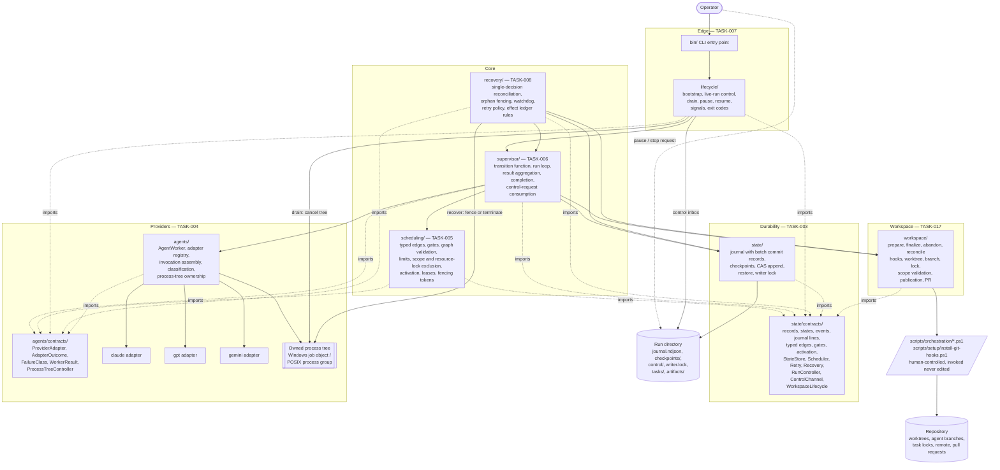

# Runtime Component Diagram

Source diagram for the autonomous runtime component decomposition. Produced under TASK-002, amended under TASK-016.

- Specification: [COMPONENT-BOUNDARIES.md](../../docs/architecture/runtime/COMPONENT-BOUNDARIES.md)
- Decisions: [ADR-0002](../../docs/adr/0002-runtime-component-boundaries-and-module-ownership.md), superseded in part by [ADR-0011](../../docs/adr/0011-agent-workspace-lifecycle-module.md); [ADR-0014](../../docs/adr/0014-live-run-control-and-process-tree-ownership.md)

Amended by TASK-016: the seventh module `workspace/` is added with TASK-017 as its owner; the control inbox is added as the live-run control transport owned by TASK-007; the owned process tree is added under TASK-004.

Each box names its owning task. No module has two owners. Arrows are permitted import or call directions; any edge not shown is a boundary violation.

## Ownership legend

| Colour-free label | Owner task | Write scope |
|---|---|---|
| `state/`, `state/contracts/` | TASK-003 | `src/orchestrator/state/**` |
| `agents/`, `agents/contracts/`, adapters, process trees | TASK-004 | `src/agents/**` |
| `scheduling/` | TASK-005 | `src/orchestrator/scheduling/**` |
| `supervisor/` | TASK-006 | `src/orchestrator/supervisor/**` |
| `lifecycle/`, `bin/`, control inbox | TASK-007 | `src/orchestrator/lifecycle/**`, `bin/**` |
| `recovery/` | TASK-008 | `src/orchestrator/recovery/**` |
| `workspace/` | TASK-017 | `src/orchestrator/workspace/**` |

`scripts/orchestration/**` and `scripts/setup/install-git-hooks.ps1` are human-controlled and appear here as an invoked boundary. No module's write scope includes them.

## Invariants visible in this diagram

1. Only `supervisor` and `store` write durable state. `scheduling`, `recovery`, and `workspace` produce event envelopes and hand them to the supervisor's append path.
2. Nothing in `src/orchestrator/**` reaches a provider adapter. The only path is `supervisor -> worker -> adapter`.
3. Both contract roots are sinks. Neither imports the other, which is what makes TASK-003 and TASK-004 genuinely parallel.
4. `lifecycle` touches `supervisor`, the control inbox, and the two contract roots. It contains no scheduling, provider, retry, or workspace logic.
5. `workspace` is the only module that reaches the repository, and it reaches it only through the human-controlled scripts. It imports one contract root and no module.
6. `lifecycle` and `recovery` reach the process tree only through `ProcessTreeController`. TASK-004 owns the mechanism; neither of them holds an implementation.
7. Every arrow points from a higher level to a lower one — contract roots at level 0; `state`, `agents`, and `workspace` at level 1; `scheduling` at 2; `supervisor` at 3; `lifecycle` and `recovery` at 4 — so the module graph is acyclic.
