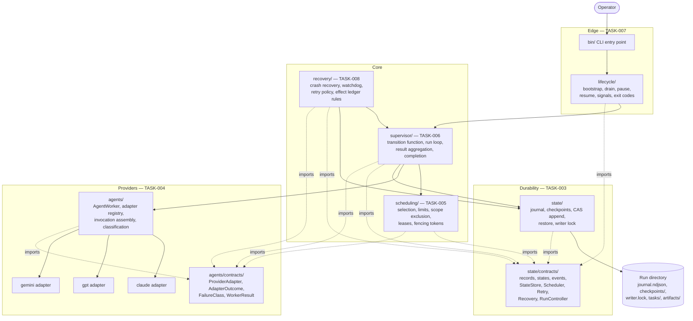

# Runtime Component Diagram

Source diagram for the autonomous runtime component decomposition. Produced under TASK-002.

- Specification: [COMPONENT-BOUNDARIES.md](../../docs/architecture/runtime/COMPONENT-BOUNDARIES.md)
- Decision: [ADR-0002](../../docs/adr/0002-runtime-component-boundaries-and-module-ownership.md)

Each box names its owning task. No module has two owners. Arrows are permitted import or call directions; any edge not shown is a boundary violation.

## Ownership legend

| Colour-free label | Owner task | Write scope |
|---|---|---|
| `state/`, `state/contracts/` | TASK-003 | `src/orchestrator/state/**` |
| `agents/`, `agents/contracts/`, adapters | TASK-004 | `src/agents/**` |
| `scheduling/` | TASK-005 | `src/orchestrator/scheduling/**` |
| `supervisor/` | TASK-006 | `src/orchestrator/supervisor/**` |
| `lifecycle/`, `bin/` | TASK-007 | `src/orchestrator/lifecycle/**`, `bin/**` |
| `recovery/` | TASK-008 | `src/orchestrator/recovery/**` |

## Invariants visible in this diagram

1. Only `supervisor` and `store` write durable state. `scheduling` and `recovery` produce event envelopes and hand them to the supervisor's append path.
2. Nothing in `src/orchestrator/**` reaches a provider adapter. The only path is `supervisor -> worker -> adapter`.
3. Both contract roots are sinks. Neither imports the other, which is what makes TASK-003 and TASK-004 genuinely parallel.
4. `lifecycle` touches only `supervisor` and `state/contracts`. It contains no scheduling, provider, or retry logic.
