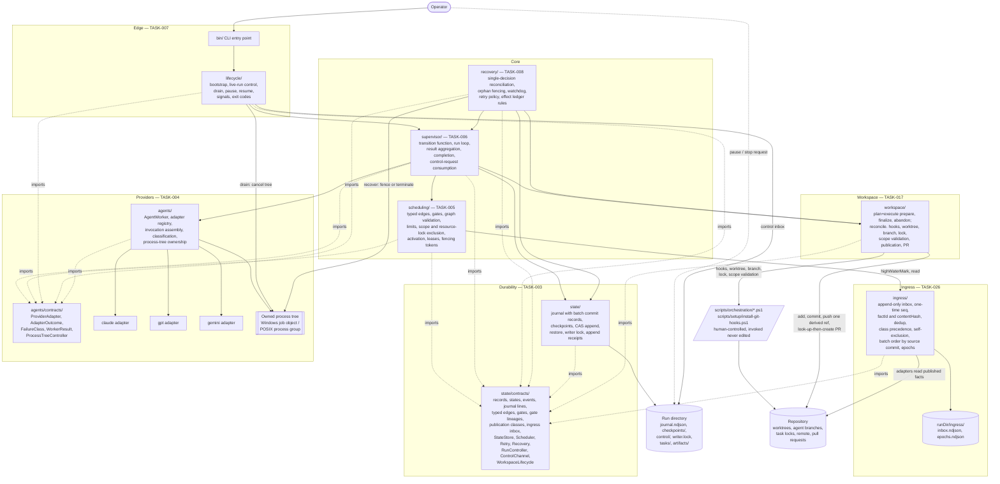

# Runtime Component Diagram

Source diagram for the autonomous runtime component decomposition. Produced under TASK-002, amended under TASK-016, amended again under TASK-024.

- Specification: [COMPONENT-BOUNDARIES.md](../../docs/architecture/runtime/COMPONENT-BOUNDARIES.md)
- Decisions: [ADR-0002](../../docs/adr/0002-runtime-component-boundaries-and-module-ownership.md), superseded in part by [ADR-0011](../../docs/adr/0011-agent-workspace-lifecycle-module.md) and [ADR-0021](../../docs/adr/0021-durable-ingress-module-and-the-eight-module-map.md); [ADR-0014](../../docs/adr/0014-live-run-control-and-process-tree-ownership.md); [ADR-0019](../../docs/adr/0019-durable-intent-receipts-for-side-effects.md)

Amended by TASK-016: the seventh module `workspace/` is added with TASK-017 as its owner; the control inbox is added as the live-run control transport owned by TASK-007; the owned process tree is added under TASK-004.

Amended by TASK-024: the **eighth** module `ingress/` is added with TASK-026 as its owner, holding the durable ingress inbox that the scheduler's observer reads. Resolving finding **A-105**, the workspace module's repository access is shown as it is contracted — delegated to the human-controlled scripts for hooks, worktree, branch, lock, and scope validation, and **direct** for commit, push, and pull-request operations. The previous diagram asserted that the module reaches the repository only through the scripts, which [WORKSPACE-LIFECYCLE.md](../../docs/architecture/runtime/WORKSPACE-LIFECYCLE.md#repository-access-paths) and sequence 7 both contradict.

Each box names its owning task. No module has two owners. Arrows are permitted import or call directions; any edge not shown is a boundary violation.

## Ownership legend

| Colour-free label | Owner task | Write scope |
|---|---|---|
| `state/`, `state/contracts/` | TASK-003 | `src/orchestrator/state/**` |
| `agents/`, `agents/contracts/`, adapters, process trees | TASK-004 | `src/agents/**` |
| `scheduling/` | TASK-005 | `src/orchestrator/scheduling/**` |
| `supervisor/` | TASK-006 | `src/orchestrator/supervisor/**` |
| `lifecycle/`, `bin/`, control inbox | TASK-007 | `src/orchestrator/lifecycle/**`, `bin/**` |
| `recovery/` | TASK-008 | `src/orchestrator/recovery/**` |
| `workspace/` | TASK-017 | `src/orchestrator/workspace/**` |
| `ingress/`, the inbox store | TASK-026 | `src/orchestrator/ingress/**` |

Eight rows, eight owner tasks, eight source paths. `scripts/orchestration/**` and `scripts/setup/install-git-hooks.ps1` are human-controlled and appear here as an invoked boundary. No module's write scope includes them.

## Repository access paths

Stated here because the previous version of this diagram contradicted the workspace contract, which is finding A-105. The normative statement is [WORKSPACE-LIFECYCLE.md](../../docs/architecture/runtime/WORKSPACE-LIFECYCLE.md#repository-access-paths); this table says the same thing.

| Module | Reaches the repository through | For |
|---|---|---|
| `workspace/` | The human-controlled scripts | Hook verification and installation, worktree and branch creation, task-lock claim, write-scope validation, task-lock release |
| `workspace/` | **Direct Git and the pull-request API** | `git add --` with the declared scope patterns, `git commit`, `git push` of exactly one derived refspec, and look-up-then-create-or-update of the pull request |
| `ingress/` | **Read-only** Git | Its adapters read facts other owners already published. They never write a ref, a commit, or a working tree |

No other module reaches the repository at all.

## Invariants visible in this diagram

1. Only `supervisor` and `store` write durable **run** state. `scheduling`, `recovery`, `workspace`, and `ingress` produce event envelopes and hand them to the supervisor's append path. `ingress` additionally owns the inbox store, which holds no run state and is never folded into a `RunRecord`.
2. Nothing in `src/orchestrator/**` reaches a provider adapter. The only path is `supervisor -> worker -> adapter`.
3. Both contract roots are sinks. Neither imports the other, which is what makes TASK-003 and TASK-004 genuinely parallel. Adding `ingress` adds one edge, `ingress -> state/contracts`, and no edge between the roots.
4. `lifecycle` touches `supervisor`, the control inbox, and the two contract roots. It contains no scheduling, provider, retry, workspace, or ingress logic.
5. `workspace` is the only module that **writes** the repository. It delegates every operation the human-controlled scripts define and performs commit, push, and pull-request operations directly, under the structural prohibitions in the contract. It imports one contract root and no module.
6. `lifecycle` and `recovery` reach the process tree only through `ProcessTreeController`. TASK-004 owns the mechanism; neither of them holds an implementation.
7. `scheduling` reaches the inbox only through `IngressInbox`. TASK-026 owns the store; TASK-005 owns the observer and the dispatch predicate and holds no persistence format.
8. Every arrow points from a higher level to a lower one — contract roots at level 0; `state`, `agents`, `workspace`, and `ingress` at level 1; `scheduling` at 2; `supervisor` at 3; `lifecycle` and `recovery` at 4 — so the module graph is acyclic.
