# Runtime Component Diagram

Source diagram for the autonomous runtime and release merge control-plane decomposition. Produced under TASK-002 and amended under TASK-016, TASK-024, TASK-028, TASK-036, TASK-040, and TASK-042.

- Specification: [COMPONENT-BOUNDARIES.md](../../docs/architecture/runtime/COMPONENT-BOUNDARIES.md)
- Decisions: [ADR-0002](../../docs/adr/0002-runtime-component-boundaries-and-module-ownership.md), superseded in part by [ADR-0011](../../docs/adr/0011-agent-workspace-lifecycle-module.md), [ADR-0021](../../docs/adr/0021-durable-ingress-module-and-the-eight-module-map.md), and proposed [ADR-0042](../../docs/adr/0042-conditionally-authorized-post-gate-merge-executors.md); [ADR-0014](../../docs/adr/0014-live-run-control-and-process-tree-ownership.md); [ADR-0019](../../docs/adr/0019-durable-intent-receipts-for-side-effects.md), amended by [ADR-0028](../../docs/adr/0028-nominal-store-issued-durable-append-receipts.md); [ADR-0029](../../docs/adr/0029-ingress-delivery-ownership.md); [ADR-0031](../../docs/adr/0031-pre-dispatch-ingress-observer-and-collector.md); [ADR-0043](../../docs/adr/0043-exact-merge-admission-policy-attestation-and-published-head-evidence.md)

Amended by TASK-016: the seventh module `workspace/` is added with TASK-017 as its owner; the control inbox is added as the live-run control transport owned by TASK-007; the owned process tree is added under TASK-004.

Amended by TASK-024: the **eighth** module `ingress/` is added with TASK-026 as its owner, holding the durable ingress inbox that the scheduler's observer reads. In response to finding **A-105**, the workspace module's repository access is shown as it is contracted — delegated to the human-controlled scripts for hooks, worktree, branch, lock, and scope validation, and **direct** for commit, push, and pull-request operations. TASK-025 later rejected the TASK-024 publication; this useful correction remains while TASK-028 supersedes the defects that remained.

Amended by TASK-028: TASK-026 owns external-fact validation, pre-dispatch collection, authorization, deduplication, and append-through-store. TASK-005 alone owns high-water signalling, observation, delivery, and scheduling policy. TASK-006 composes collect → signal → observe → select → deliver, and carries the immutable delivery into `AgentInvocation`. The state root alone declares nominal receipts; the independent agent root receives an opaque value and a supervisor-supplied verifier narrowed to process registration.

Amended by TASK-036: the collector's append/deduplicate outcome is total and returns identity plus a committed mark without reading an activation range. The nominal receipt rule gains a cross-root conformance check: one state-root declaration, no agent-root copy, and an `unknown` plus verifier crossing.

Amended by TASK-040: the ninth module is the runtime task integration executor and the tenth is the separate DevOps release merge executor. Both use a narrow protected-PR API after durable intent and publish verified results for TASK-026's adapter. Neither appends, pushes a protected ref, mutates a gate or policy, or imports the other. TASK-041 recorded `changes-required`.

Amended by TASK-042: generic formal acceptance cannot reach a plan, and a separate human-controlled policy attestor supplies complete fresh signed branch/ruleset/bypass evidence. The attestor is an external trust boundary, not an eleventh module or import node; neither executor receives its privileged observation credential. Activation and implementation work remain blocked behind TASK-044 and the returned control-plane dependencies.

Each box names its owning task. No module has two owners. Arrows are permitted import or call directions; any edge not shown is a boundary violation.

```mermaid
flowchart TB
  operator([Operator])

  subgraph edge["Edge — TASK-007"]
    cli["bin/ CLI entry point"]
    lifecycle["lifecycle/<br/>bootstrap, live-run control,<br/>drain, pause, resume,<br/>signals, exit codes"]
  end

  subgraph core["Core"]
    supervisor["supervisor/ — TASK-006<br/>transition function, run loop,<br/>result aggregation, completion,<br/>control-request consumption"]
    scheduling["scheduling/ — TASK-005<br/>task-record projection, typed edges and gates,<br/>graph validation, limits and locks,<br/>ingress signal, observation, delivery,<br/>activation, leases, fencing tokens"]
    recovery["recovery/ — TASK-008<br/>single-decision reconciliation,<br/>orphan fencing, watchdog,<br/>retry policy, effect ledger rules"]
    integration["integration/ — future runtime task<br/>task gate/security admission,<br/>durable intent + reconciliation,<br/>fixed integration squash merge"]
  end

  subgraph release["Release control plane — future DevOps task"]
    releaseMerge["scripts/release/integration-merge/<br/>seven aggregate gate domains,<br/>durable intent + reconciliation,<br/>fixed integration-to-main merge"]
  end

  subgraph ws["Workspace — TASK-017"]
    workspace["workspace/<br/>plan+execute prepare, finalize, abandon;<br/>reconcile. hooks, worktree, branch, lock,<br/>scope validation, publication, PR"]
  end

  subgraph ing["Ingress — TASK-026"]
    ingress["ingress/<br/>append-only inbox, one-time seq,<br/>validator + pre-dispatch collector,<br/>merge-result adapter + authorized append,<br/>factId dedup, precedence, epochs"]
    inboxStore[("runDir/ingress/<br/>inbox.ndjson, epochs.ndjson")]
  end

  subgraph durable["Durability — TASK-003"]
    store["state/<br/>journal with batch commit records,<br/>checkpoints, CAS append, restore,<br/>writer lock, nominal subject-bearing<br/>append receipts + verifier"]
    scontracts["state/contracts/<br/>records, states, events, journal lines,<br/>typed edges, gates, gate lineages,<br/>publication classes, ingress inbox,<br/>StateStore, Scheduler, Retry, Recovery,<br/>RunController, ControlChannel,<br/>WorkspaceLifecycle"]
  end

  subgraph provider["Providers — TASK-004"]
    worker["agents/<br/>AgentWorker, adapter registry,<br/>invocation with read-only ingress,<br/>classification, process-tree ownership"]
    acontracts["agents/contracts/<br/>ProviderAdapter, AdapterOutcome,<br/>FailureClass, WorkerResult,<br/>ProcessTreeController,<br/>narrowed receipt-verifier view"]
    claude["claude adapter"]
    gpt["gpt adapter"]
    gemini["gemini adapter"]
    tree[["Owned process tree<br/>Windows job object /<br/>POSIX process group"]]
  end

  runDir[("Run directory<br/>journal.ndjson, checkpoints/,<br/>control/, writer.lock,<br/>tasks/, artifacts/")]
  repo[("Repository<br/>worktrees, agent branches,<br/>task locks, remote, pull requests")]
  github[("GitHub protected branches<br/>required checks, no bypass,<br/>ordinary PR merge endpoint")]
  mergeEvidence[("External merge evidence<br/>append-only intent + outcome<br/>by executor/idempotency key")]
  policyAttestor[/"Human-controlled policy attestor<br/>complete classic + inherited rulesets<br/>complete bypass actors, signed + fresh"/]
  policyCredential[("Isolated policy observation credential<br/>never exposed to either executor")]
  scripts[/"scripts/orchestration/*.ps1<br/>scripts/setup/install-git-hooks.ps1<br/>human-controlled, invoked never edited"/]

  operator --> cli
  operator -. "pause / stop request" .-> runDir
  cli --> lifecycle
  lifecycle --> supervisor
  lifecycle -- "control inbox" --> runDir
  supervisor -- "signal, observe, select,<br/>deliver exact activation range" --> scheduling
  supervisor -- "collect external fact before selection;<br/>returns disposition + factId + committed mark" --> ingress
  supervisor --> workspace
  supervisor -- "admitted task content unit" --> integration
  supervisor -- "AgentInvocation.ingress + opaque receipt;<br/>inject narrowed verifier" --> worker
  supervisor --> store
  recovery --> supervisor
  recovery --> workspace
  recovery --> store
  store --> runDir
  scheduling -- "highWaterMark + exact range read;<br/>never append" --> ingress
  ingress --> inboxStore
  ingress -- "adapters read published facts" --> repo
  ingress -- "validate terminal merge result" --> mergeEvidence

  integration -- "fixed PR, head SHA, squash;<br/>never push" --> github
  releaseMerge -- "fixed integration PR, head SHA, merge;<br/>never push" --> github
  policyCredential -. "privileged observation only" .-> policyAttestor
  policyAttestor -. "plan-bound signed attestation;<br/>no merge capability" .-> integration
  policyAttestor -. "plan-bound signed attestation;<br/>no merge capability" .-> releaseMerge
  policyAttestor -. "observe current controls" .-> github
  integration --> mergeEvidence
  releaseMerge --> mergeEvidence
  github --> repo

  workspace -- "hooks, worktree, branch,<br/>lock, scope validation" --> scripts
  scripts --> repo
  workspace -- "add, commit, push one derived ref,<br/>look-up-then-create PR" --> repo

  worker --> claude
  worker --> gpt
  worker --> gemini
  worker --> tree
  lifecycle -- "drain: cancel tree" --> tree
  recovery -- "recover: fence or terminate" --> tree

  scheduling -.imports.-> scontracts
  supervisor -.imports.-> scontracts
  lifecycle -.imports.-> scontracts
  recovery -.imports.-> scontracts
  store -.imports.-> scontracts
  workspace -.imports.-> scontracts
  ingress -.imports.-> scontracts
  integration -.imports.-> scontracts
  supervisor -.imports.-> acontracts
  scheduling -.imports.-> acontracts
  lifecycle -.imports.-> acontracts
  recovery -.imports.-> acontracts
  worker -.imports.-> acontracts
```

## Ownership legend

| Colour-free label | Owner task | Write scope |
|---|---|---|
| `state/`, `state/contracts/` | TASK-003 | `src/orchestrator/state/**` |
| `agents/`, `agents/contracts/`, adapters, process trees | TASK-004 | `src/agents/**` |
| `scheduling/` | TASK-005 | `src/orchestrator/scheduling/**` |
| `supervisor/` | TASK-006 | `src/orchestrator/supervisor/**` |
| `lifecycle/`, `bin/`, control inbox | TASK-007 | `src/orchestrator/lifecycle/**`, `bin/**` |
| `recovery/` | TASK-008 | `src/orchestrator/recovery/**` |
| `workspace/` | TASK-017 | `src/orchestrator/workspace/**` |
| `ingress/`, the inbox store | TASK-026 | `src/orchestrator/ingress/**` |
| `integration/` | Future `runtime` implementation task after a passing TASK-044 or later verdict | `src/orchestrator/integration/**`, tests under `tests/unit/orchestrator/integration/**` |
| `scripts/release/integration-merge/` | Future `devops` implementation task after a passing TASK-044 or later verdict | `scripts/release/integration-merge/**` |

Ten rows and ten distinct source paths. The eight existing modules retain task owners; the two proposed modules have distinct future owner roles and are not one component. `scripts/orchestration/**` and `scripts/setup/install-git-hooks.ps1` are human-controlled and appear here as an invoked boundary. No module's write scope includes them.

## Repository access paths

Stated here because the previous version of this diagram contradicted the workspace contract, which is finding A-105. The normative statement is [WORKSPACE-LIFECYCLE.md](../../docs/architecture/runtime/WORKSPACE-LIFECYCLE.md#repository-access-paths); this table says the same thing.

| Module | Reaches the repository through | For |
|---|---|---|
| `workspace/` | The human-controlled scripts | Hook verification and installation, worktree and branch creation, task-lock claim, write-scope validation, task-lock release |
| `workspace/` | **Direct Git and the pull-request API** | `git add --` with the declared scope patterns, `git commit`, `git push` of exactly one derived refspec, and look-up-then-create-or-update of the pull request |
| `ingress/` | **Read-only** Git | Its adapters read facts other owners already published. They never write a ref, a commit, or a working tree |
| `integration/` | Narrow GitHub API | Read immutable PR/check/policy state and invoke only the exact-head squash merge into the configured integration branch |
| `scripts/release/integration-merge/` | Separate narrow GitHub API identity | Read immutable release/PR/check/policy state and invoke only the exact-head protected merge from integration into `main` |

No other module reaches the repository. Neither executor spawns `git push`, and neither receives a generic ref, administration, policy-observation, or policy-mutation port. The external attestor observes policy and returns only a signed payload; it is not a repository module and has no executor merge port.

## Invariants visible in this diagram

1. Only `supervisor` and `store` write durable **run** state. `scheduling`, `recovery`, `workspace`, `ingress`, and `integration` hand results to the supervisor's composition boundaries. `ingress` owns the separate inbox; both executors own separate merge-evidence namespaces and never write the run journal.
2. Nothing in `src/orchestrator/**` reaches a provider adapter. The only path is `supervisor -> worker -> adapter`.
3. Both contract roots are sinks. Neither imports the other. `integration` adds only `integration -> state/contracts`; the release module imports neither root. No edge exists between the roots and no third contract root exists.
4. `lifecycle` touches `supervisor`, the control inbox, and the two contract roots. It contains no scheduling, provider, retry, workspace, or ingress logic.
5. `workspace` is the only module that writes a working tree, commit, or task ref. It delegates every operation the human-controlled scripts define and performs commit, one derived task-branch push, and pull-request publication under its structural prohibitions. The executors can invoke only a protected PR merge endpoint and cannot construct a ref push.
6. `lifecycle` and `recovery` reach the process tree only through `ProcessTreeController`. TASK-004 owns the mechanism; neither of them holds an implementation.
7. `ingress` is the only module that validates and appends external facts; `scheduling` is the only module that signals, observes, and delivers an activation range. The supervisor composes the calls before selection and carries the delivery into the invocation. The activation holds neither an inbox nor an append capability.
8. The nominal receipt brand exists only in `state/contracts`. The supervisor supplies TASK-004 with an `AgentReceiptVerifier` that exposes only a verified process-registration subject; the agent root neither imports the state root nor redeclares its brand.
9. The complete graph has 12 nodes and 19 import edges. Its level witness is: level 0 `state/contracts`, `agents/contracts`, and self-contained `release-integration-merge`; level 1 `state`, `agents`, `workspace`, `ingress`, `integration`; level 2 `scheduling`; level 3 `supervisor`; level 4 `lifecycle`, `recovery`. Every import edge descends, so the graph is acyclic. Exactly two level-0 nodes are contract roots and no path joins them.
10. A verified merge result reaches state only through TASK-026 append, TASK-005 signal/observe/deliver, and the ordinary supervisor transition. No executor can append its own trigger.
11. The external policy attestor adds no module/import node. It binds both executor App identities and every complete bypass set in one fresh signed payload; missing or redacted actors fail closed.

The receipt invariant is checked by enumerating semantic declarations: exactly one `DURABLE_RECEIPT_BRAND` and one `ProcessGroupRegistrationReceipt`, both in the state root; zero of either declaration in the agent root; `receipt: unknown` on both agent-side side-effect boundaries; and one `AgentReceiptVerifier` narrowing surface. The collector invariant is checked by the append-committed/signal-absent retry fixture; only TASK-005's later `deliver` call may read the activation range.
