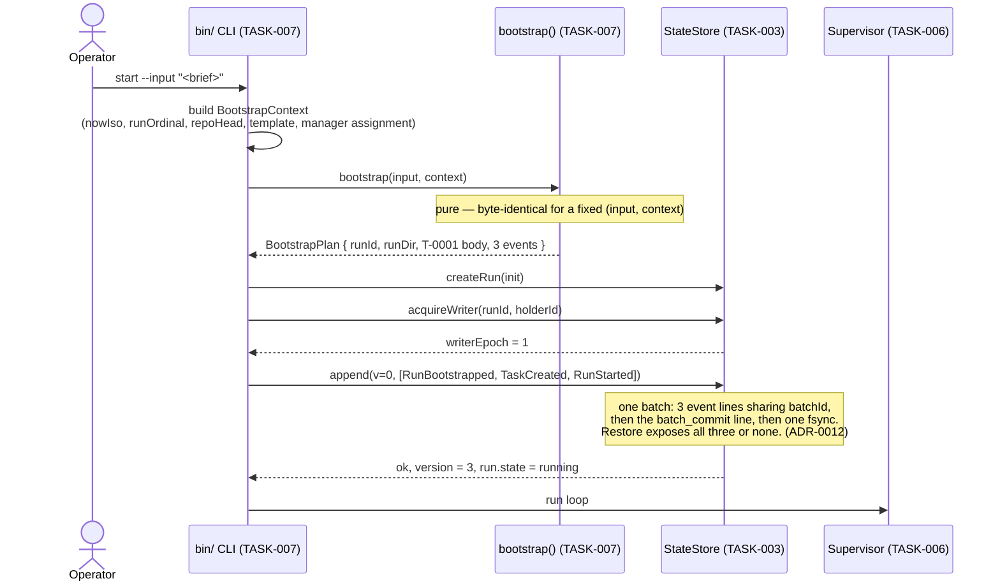
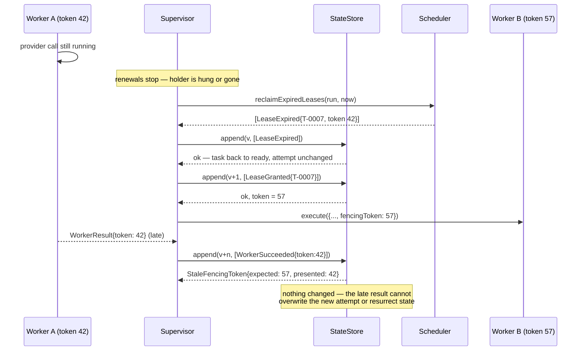

# Runtime Sequence Diagrams

Source diagrams for the seven sequences that carry the runtime's guarantees. Produced under TASK-002, amended under TASK-016.

Specifications: [LEASES-AND-SCHEDULING.md](../../docs/architecture/runtime/LEASES-AND-SCHEDULING.md), [CRASH-RECOVERY.md](../../docs/architecture/runtime/CRASH-RECOVERY.md), [LIFECYCLE-AND-BOOTSTRAP.md](../../docs/architecture/runtime/LIFECYCLE-AND-BOOTSTRAP.md), [WORKSPACE-LIFECYCLE.md](../../docs/architecture/runtime/WORKSPACE-LIFECYCLE.md), [PROVIDER-ADAPTERS.md](../../docs/architecture/runtime/PROVIDER-ADAPTERS.md), [DURABLE-STATE-AND-CHECKPOINTS.md](../../docs/architecture/runtime/DURABLE-STATE-AND-CHECKPOINTS.md).

Amended by TASK-016: every append is shown as a framed batch with a commit record (A-001); the recovery sequence is rebuilt around one decision per task (A-002); three sequences are added for live-run control, process-tree termination, and the workspace lifecycle (A-003 and the workspace module gap).

## 1. Bootstrap — one input to a running run



## 2. Dispatch: workspace, lease, and fencing

```mermaid
sequenceDiagram
  participant Sup as Supervisor (TASK-006)
  participant Sched as Scheduler (TASK-005)
  participant WS as WorkspaceLifecycle (TASK-017)
  participant Store as StateStore (TASK-003)
  participant Worker as AgentWorker (TASK-004)
  participant Adapter as ProviderAdapter (TASK-004)

  Sup->>Sched: selectDispatchable(run, now)
  Note over Sched: gates: readiness by typed edge, global limit,<br/>per-role limit, write-scope exclusion,<br/>resource lock, workspace readiness<br/>order: (activationClass, createdSeq, taskId)
  Sched-->>Sup: [candidate T-0007]
  Sup->>Sched: grantLease(run, candidate, now)
  Sched-->>Sup: envelope LeaseGranted (token placeholder -1)
  Sup->>Store: append(v, [LeaseGranted])
  Note over Store: substitutes assigned stateVersion<br/>as the fencing token
  Store-->>Sup: ok, token = 42

  Sup->>WS: prepare({runId, taskId, attempt, role, llm, baseRef})
  Sup->>Store: append([WorkspacePrepareIntended])
  Note over WS: hooks verified, create-worktree.ps1,<br/>claim-task.ps1 — invoked, never reimplemented
  WS-->>Sup: handle{prepared}, events
  Sup->>Store: append([WorkspacePrepared{lockSessionId}])

  Sup->>Store: append([DispatchStarted{token:42, attempt:1, idempotencyKey}])
  Note over Store: illegal unless the workspace is prepared;<br/>sets attemptStartedAt
  Sup->>Worker: execute({invocation with WorkspaceRef, fencingToken: 42}, signal)
  Worker->>Store: append([ProcessGroupRegistered]) before the spawn
  Worker->>Adapter: invoke(invocation, signal) — spawned into an owned group
  Worker->>Store: append([ProcessGroupBound{pid, groupRef, processStartTime}])

  loop every leaseRenewIntervalMs
    Sup->>Store: append(LeaseRenewed{token:42})
    Note over Store: expiresAt extended, token unchanged
  end

  Adapter-->>Worker: AdapterOutcome
  Worker->>Store: append([ProcessGroupClosed{verifiedExit:true}])
  Worker-->>Sup: WorkerResult{token: 42}
  Sup->>WS: finalize(handle, {commitMessage, writeScope, remote, integrationBranch})
  Note over WS: validate-write-scope.ps1, commit, push one derived ref,<br/>look up then create-or-update the PR,<br/>persist identity, then release-task.ps1
  WS-->>Sup: publication, events
  Sup->>Store: append(v, [ArtifactPublished, WorkspaceFinalized, WorkerSucceeded{token:42}])
  Store-->>Sup: ok
```

## 3. Lease expiry and the rejected late write

The sequence fencing exists for. No coordination with the abandoned worker is needed.



## 4. Crash recovery — one decision per task

Amended by TASK-016. The superseded version showed phase 4 emitting `LeaseExpired` and phases 5 and 6 then emitting `WorkerSucceeded`, `TaskBlocked`, or `TaskTimedOut` for the same task in the same batch. That is finding A-002: those events are legal only from `running`, and phase 4 had already moved the task to `ready`.

```mermaid
sequenceDiagram
  participant P2 as New process (epoch 2)
  participant Rec as RecoveryCoordinator (TASK-008)
  participant Store as StateStore (TASK-003)
  participant WS as WorkspaceLifecycle (TASK-017)
  participant Tree as ProcessTreeController (TASK-004)

  Note over P2: previous process died in `running` at epoch 1

  P2->>Rec: recover(runId, {holderId, now})
  Rec->>Store: acquireWriter(runId, holderId)
  alt heartbeat is fresh
    Store-->>Rec: WriterAlive — abort the attach
  else stale or absent
    Store-->>Rec: epoch = 2
  end

  Rec->>Store: restore(runId)
  Store->>Store: newest checksum-valid checkpoint<br/>+ committed batches only;<br/>uncommitted suffix discarded whole
  Store-->>Rec: run, version, fromCheckpoint, replayedEvents,<br/>discardedUncommittedEvents, lastCommittedBatchId
  Rec->>Store: truncateToLastCommittedBatch(runId)

  Rec->>Store: append([RunResumeRequested{epoch:2}])
  Note over Store: run -> recovering

  Rec->>Tree: Phase 5 — reclaimOrphan for every registered, unclosed invocation
  Note over Tree: fence always; terminate when bound and identity verifies;<br/>pid_reuse or unbound -> orphan_unresolved
  Tree-->>Rec: TreeCloseOutcome[]
  Rec->>WS: Phase 6 — reconcile(runId, context)
  Note over WS: never force-releases a lock, never republishes,<br/>never opens a second pull request
  WS-->>Rec: WorkspaceReconcileEntry[]

  Rec->>Rec: Phase 4 — one decision per task from the restored record<br/>inputs: pre-batch state, lease state, ledger state, deadline<br/>(Phase 6 findings are an input, not a second pass)
  Note over Rec: adopt | escalate | reclaim |<br/>retry_timeout | exhaust_timeout | none

  Rec->>Store: append(v, [one event sequence per task,<br/>ProcessGroupClosed*, WorkspaceReconciled*,<br/>RunRecoveryCompleted last])
  Note over Store: one batch with a commit record.<br/>Every event is legal from the restored state,<br/>by construction. No two address the same task.
  Store-->>Rec: ok — run -> running
  Rec->>Store: checkpoint(runId, version)
```

## 5. Live-run control — a second `pause` reaching a running supervisor

```mermaid
sequenceDiagram
  actor Operator
  participant CLI2 as bin/ CLI, second invocation
  participant Inbox as runDir/control/
  participant Sup as Supervisor (TASK-006)
  participant Ctl as ControlChannel (TASK-007)
  participant Store as StateStore (TASK-003)

  Operator->>CLI2: pause --run <runId>
  CLI2->>CLI2: read writer.lock -> targetWriterEpoch
  CLI2->>Ctl: submit({requestId, runId, kind:'pause', requestedBy, targetWriterEpoch})
  Ctl->>Inbox: write req-<id>.json.tmp, fsync, rename, fsync dir

  loop each run-loop iteration
    Sup->>Ctl: drainPending(run, now)
    Ctl->>Inbox: read all req-*.json
    Note over Ctl: validate kind, size, id pattern, epoch, TTL;<br/>sort by (requestedAt, requestId);<br/>stop outranks pause in one pass
    Ctl-->>Sup: accepted[], rejected[] (rejections already acked and swept)
  end

  Sup->>Store: append([ControlRequestAccepted{requestId}, RunPauseRequested])
  Note over Store: durable ordering is journal order;<br/>a duplicate requestId is rejected
  Store-->>Sup: ok — run -> pausing
  Sup->>Ctl: acknowledge({requestId, status:'accepted', runState, stateVersion})
  Ctl->>Inbox: write ack-<id>.json, move request to consumed/

  CLI2->>Ctl: awaitAck(requestId, controlAckTimeoutMs)
  Ctl-->>CLI2: accepted
  CLI2-->>Operator: Turkish message; exit 0
```

## 6. Drain deadline: process-tree termination with verified exit

The sequence finding A-003 exists for. A child that spawns a grandchild and ignores the first cancellation must not survive the command.

```mermaid
sequenceDiagram
  participant Life as lifecycle (TASK-007)
  participant Tree as ProcessTreeController (TASK-004)
  participant Child as provider process
  participant GChild as grandchild
  participant Store as StateStore (TASK-003)

  Note over Life: drainTimeoutMs elapsed; tasks abandoned at the task level

  Life->>Tree: cancelTree(invocationId, deadlines)
  Tree->>Child: AbortSignal, then graceful termination to the whole group
  Note over Child: traps it and keeps running — the expected case
  GChild-->>GChild: still alive

  Note over Tree: gracefulCancelGraceMs elapses
  Tree->>Child: forced: SIGKILL to -pgid / TerminateJobObject
  Tree->>GChild: same signal, same group

  loop until treeExitVerifyTimeoutMs
    Tree->>Tree: verify — kill(-pgid,0) == ESRCH /<br/>job reports zero assigned pids
  end
  Tree-->>Life: TreeCloseOutcome{escalation:'forced', verifiedExit:true}

  Life->>Store: append([ProcessGroupClosed])
  Note over Store: must be durable BEFORE releaseWriter
  Life->>Store: checkpoint, then append([RunDrainCompleted{intent:'pause'}])
  Life->>Store: releaseWriter(runId, epoch)
```

## 7. Workspace finalize: publication and idempotent pull-request identity

```mermaid
sequenceDiagram
  participant Sup as Supervisor (TASK-006)
  participant WS as WorkspaceLifecycle (TASK-017)
  participant Scripts as scripts/orchestration/*.ps1
  participant Git as repository and remote
  participant Store as StateStore (TASK-003)

  Sup->>Store: append([WorkspaceFinalizeIntended])
  Sup->>WS: finalize(handle, request)

  WS->>Scripts: validate-write-scope.ps1 -IncludeWorkingTree
  alt non-zero exit
    Scripts-->>WS: failure
    WS-->>Sup: failed — no commit, no push, no PR
  else valid
    WS->>Git: git add -- <declared write scope>; git commit
    WS->>Git: git push origin refs/heads/agent/<llm>/<role>/<task-id>
    Note over WS,Git: the only push the module can construct;<br/>no ref parameter, no --no-verify, no ALLOW_MAIN_PUSH
    alt remote unreachable or credentials absent
      Git-->>WS: failure
      WS-->>Sup: blocked{typed class, reason} — never "succeeded" on a local commit
    else pushed
      WS->>Git: look up an open PR with head = task branch
      alt one exists
        WS->>Git: update it
      else none
        WS->>Git: create one, base = integration branch
      end
      WS-->>Sup: publication{commit, branch, pullRequest}, events
      Sup->>Store: append([ArtifactPublished])
      Note over Store: identity is durable BEFORE the lock is released
      WS->>Scripts: release-task.ps1 (never -Force, only our session)
      Sup->>Store: append([WorkspaceFinalized])
    end
  end
```
