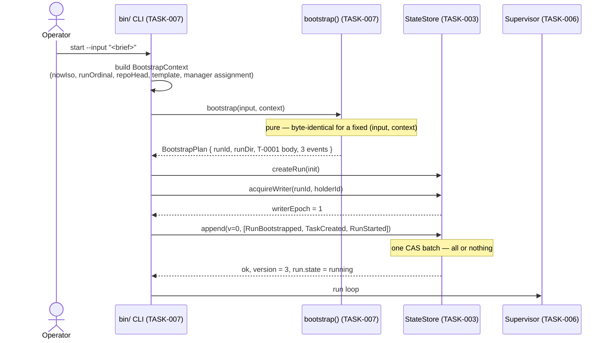
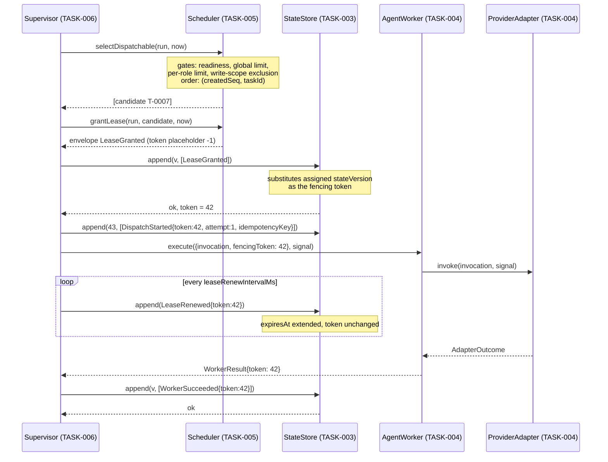
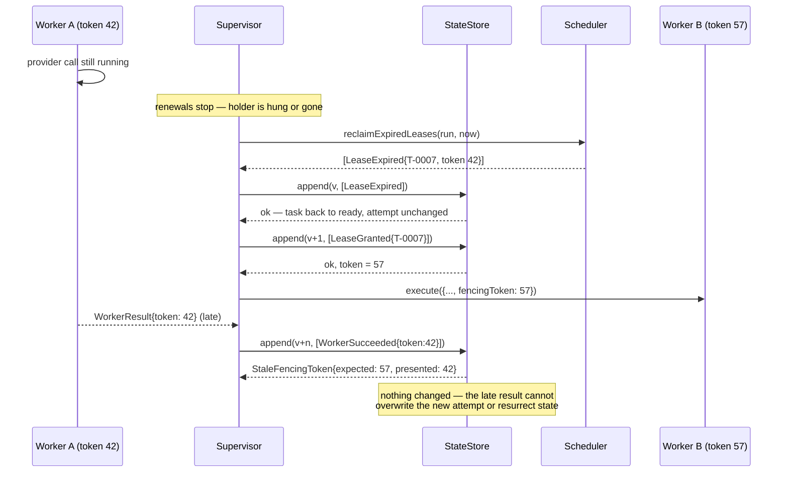
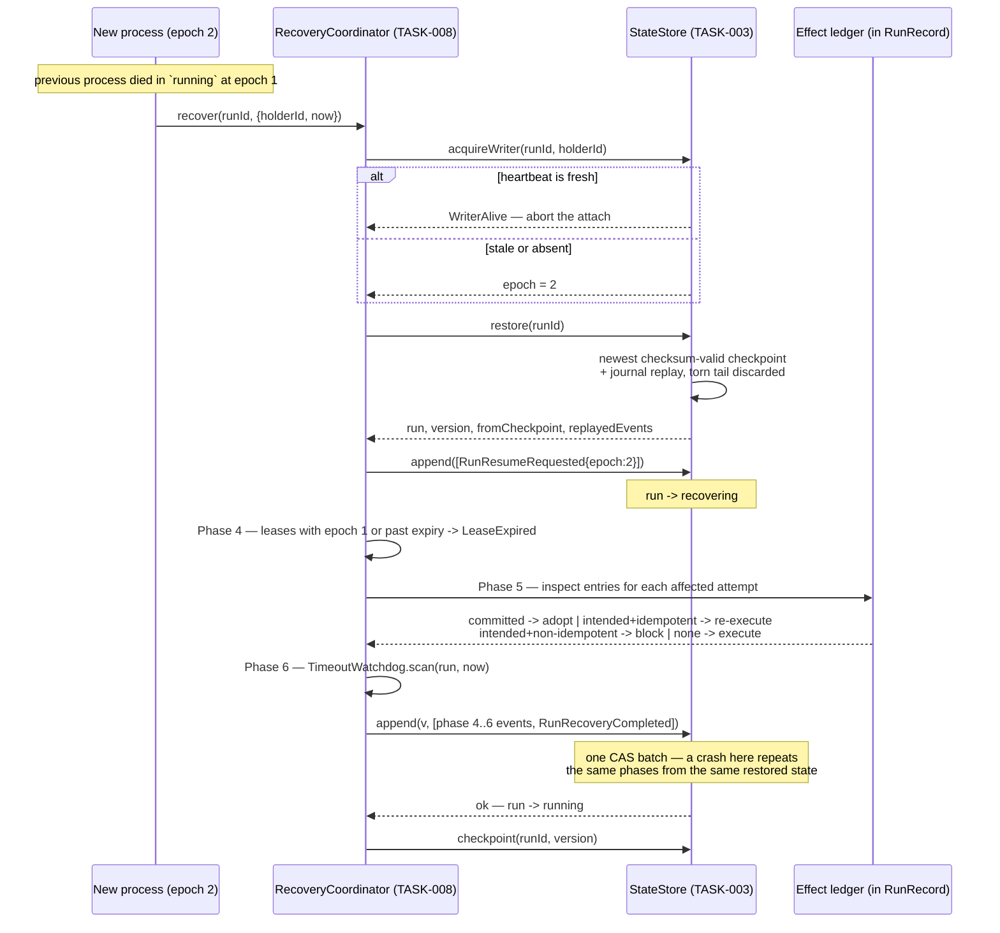

# Runtime Sequence Diagrams

Source diagrams for the four sequences that carry the runtime's guarantees. Produced under TASK-002.

Specifications: [LEASES-AND-SCHEDULING.md](../../docs/architecture/runtime/LEASES-AND-SCHEDULING.md), [CRASH-RECOVERY.md](../../docs/architecture/runtime/CRASH-RECOVERY.md), [LIFECYCLE-AND-BOOTSTRAP.md](../../docs/architecture/runtime/LIFECYCLE-AND-BOOTSTRAP.md).

## 1. Bootstrap — one input to a running run

## 2. Dispatch, lease, and fencing

## 3. Lease expiry and the rejected late write

The sequence fencing exists for. No coordination with the abandoned worker is needed.

## 4. Crash recovery

