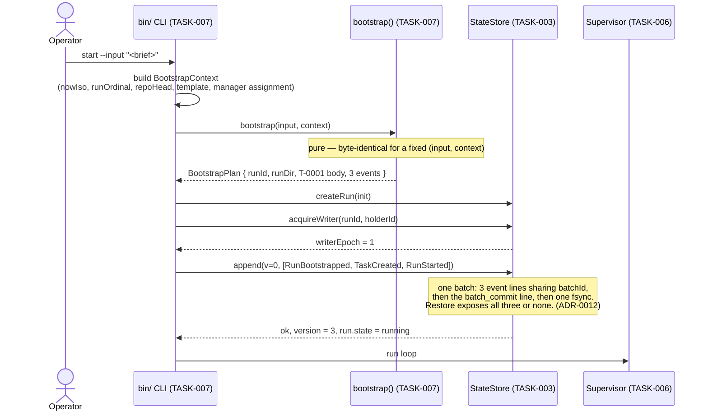

# Runtime Sequence Diagrams

Source diagrams for the ten sequences that carry the runtime and release-control guarantees. Produced under TASK-002 and amended under TASK-016, TASK-024, TASK-028, TASK-032, TASK-034, TASK-036, TASK-038, TASK-040, and TASK-042.

Specifications: [LEASES-AND-SCHEDULING.md](../../docs/architecture/runtime/LEASES-AND-SCHEDULING.md), [CRASH-RECOVERY.md](../../docs/architecture/runtime/CRASH-RECOVERY.md), [LIFECYCLE-AND-BOOTSTRAP.md](../../docs/architecture/runtime/LIFECYCLE-AND-BOOTSTRAP.md), [WORKSPACE-LIFECYCLE.md](../../docs/architecture/runtime/WORKSPACE-LIFECYCLE.md), [PROVIDER-ADAPTERS.md](../../docs/architecture/runtime/PROVIDER-ADAPTERS.md), [DURABLE-STATE-AND-CHECKPOINTS.md](../../docs/architecture/runtime/DURABLE-STATE-AND-CHECKPOINTS.md), [STATE-MACHINE.md](../../docs/architecture/runtime/STATE-MACHINE.md), [POST-GATE-MERGE-EXECUTORS.md](../../docs/architecture/runtime/POST-GATE-MERGE-EXECUTORS.md).

Amended by TASK-016: every append is shown as a framed batch with a commit record (A-001); the recovery sequence is rebuilt around one decision per task (A-002); three sequences are added for live-run control, process-tree termination, and the workspace lifecycle (A-003 and the workspace module gap).

TASK-024 authored the following responses to findings **A-102** through **A-105**. TASK-025 later rejected that publication; TASK-028 retains the useful corrections and supersedes the remaining defects without treating the earlier authoring baseline as approved:

- Sequence 2 no longer shows the worker appending durable state. It shows the three-phase handshake in which the **supervisor** appends `ProcessGroupRegistered` before the spawn and hands the worker a receipt. The previous version violated the declared module boundary, which is what A-102 recorded.
- Sequence 2 also shows the durable result record before the result effect is committed (A-104).
- Sequence 4 shows recovery building `WorkerSucceeded` from `run.pendingResults` (A-104).
- Sequence 6 shows the drain's blocked outcome when a tree cannot be verified closed (A-102, ADR-0022).
- Sequence 7 is rebuilt around the split-phase workspace protocol, with the intent durable before any script or Git command (A-103), and shows both repository access paths rather than only the delegated one (A-105).
- Sequence 8 is new: the ingress loop from an owner's publication to quiescence.

Amended by TASK-028:

- Sequence 2 records the unique result-effect intent and commit in the same uninterrupted order recovery adopts, and splits finalization around the durable publication append.
- Sequence 4 uses the canonical `ReconciliationInput` and selects invocations whose latest closure is absent **or unverified**.
- Sequence 6 gives both blocked-drain states a legal attach path and reissues their retained intent after recovery.
- Sequence 7 makes publication identity durable before `completeFinalize` may release the task lock.
- Sequence 8 shows the HUMAN-002 pre-dispatch collector, TASK-005 signal/observation/delivery, and invocation-carried immutable entries; the activation never reads or appends the inbox.

Amended by TASK-032 (historical authoring baseline; TASK-033 later recorded `changes-required`):

- Sequence 2 makes `RegistrationNotDurable` an explicit result branch of both `beginInvocation` and `spawnOwned` for missing, forged, stale-epoch, or mismatched registration proof.
- Sequences 2 and 7 call `completeFinalize(continuation, publicationReceipt)`, matching the normative two-argument contract.
- Sequence 4 derives adoption from exactly one committed flagged result effect, carries its identity, and fails closed when duplicate flagged intents exist.
- Sequence 8 contains `WorkerResultRecorded`, the flagged `EffectIntentRecorded`, effect execution, `EffectCommitted`, and `WorkerSucceeded` in the one legal order.

Amended by TASK-034 (architecture amendment only; independent TASK-035 review pending):

- Sequence 3 no longer calls the withdrawn opaque `AgentWorker.execute`. Retry dispatch uses `planInvocation`, supervisor-owned durable `ProcessGroupRegistered`, the proof-bearing `beginInvocation`, supervisor-owned `ProcessGroupBound`, and `completeInvocation` before demonstrating rejection of the old worker's late write.
- TASK-032's result-effect order, proof refusals, and both correct two-argument `completeFinalize` calls remain unchanged.

Amended by TASK-036 (architecture amendment only; independent TASK-037 owns the verdict):

- Sequences 2 and 3 branch on typed `WorkerPlanResult`; an unknown provider family records its classified failure before any registration append or spawn.
- Sequence 3 names the state-root `ProcessGroupRegistrationReceipt` and shows that it crosses the agent boundary as `unknown` plus the verifier.
- Sequence 4 emits one sequentially legal decision block per task, including the required R4/R7 timeout pair, and constructs the exact five-array `RunRecoveryCompletedEvent`.
- Sequence 8 makes append and collector success total over `appended` and `deduplicated`, including the crash-after-append/before-signal retry without a collector range read.

Amended by TASK-038 (architecture amendment only; independent TASK-039 owns the verdict):

- Sequence 9 shows the single cumulative architecture content merge and the atomic direct/subsumed lifecycle-evidence batch. Superseded predecessor branches never reach Git after the cumulative target.

Amended by TASK-040 (architecture amendment only; independent TASK-041 owned the round-1 verdict):

- Sequence 9 replaces the Orchestrator's Git operation with durable plan/execute by the runtime executor, TASK-026 result append, and ordinary TASK-005 scheduler wake-up. ADR-0041's one content unit and exact direct/subsumed state batch are unchanged.
- Sequence 10 shows the separate DevOps release executor checking all seven aggregate domains, persisting intent, merging only the protected integration PR into `main`, reconciling an ambiguous result, and publishing through the same authorized ingress path.

TASK-041 recorded `changes-required`. Amended by TASK-042 (cumulative architecture correction only; independent TASK-044 owns the verdict):

- Sequences 9 and 10 require `ExecutorGateAdmissibility`; a generic formal acceptance follows no plan or merge arrow. Only exact immutable matching High/Critical accepted-security-risk evidence can represent HUMAN-004's first exception.
- Both sequences obtain a complete fresh plan-bound signed policy attestation from the separate human-controlled policy plane before intent and immediately before mutation. Missing/redacted bypass actors, expiry, revocation, or drift follows no merge arrow. The executor never receives the observer credential.

## 1. Bootstrap — one input to a running run



## 2. Dispatch: workspace, lease, and fencing

```mermaid
sequenceDiagram
  participant Sup as Supervisor (TASK-006)
  participant Sched as Scheduler (TASK-005)
  participant WS as WorkspaceLifecycle (TASK-017)
  participant Store as StateStore (TASK-003)
  participant Worker as AgentWorker (TASK-004)
  participant Adapter as ProviderAdapter (TASK-004)

  Sup->>Sched: selectDispatchable(run, now)
  Note over Sched: gates: readiness by typed edge, global limit,<br/>per-role limit, write-scope exclusion,<br/>resource lock, workspace readiness<br/>order: (activationClass, createdSeq, taskId)
  Sched-->>Sup: [candidate T-0007]
  Sup->>Sched: grantLease(run, candidate, now)
  Sched-->>Sup: envelope LeaseGranted (token placeholder -1)
  Sup->>Store: append(v, [LeaseGranted])
  Note over Store: substitutes assigned stateVersion<br/>as the fencing token
  Store-->>Sup: ok, token = 42

  Sup->>WS: planPrepare({runId, taskId, attempt, role, llm, baseRef})
  Note over WS: pure — derives and validates branch and worktree;<br/>no script, no git, no filesystem write
  WS-->>Sup: plan{ intentEvent: WorkspacePrepareIntended }
  Sup->>Store: append([WorkspacePrepareIntended])
  Store-->>Sup: ok, receipts[0]
  Sup->>WS: executePrepare(plan, receipt)
  Note over WS: refuses without the receipt (INTENT_NOT_DURABLE).<br/>hooks verified, create-worktree.ps1,<br/>claim-task.ps1 — invoked, never reimplemented
  WS-->>Sup: handle{prepared}, events
  Sup->>Store: append([WorkspacePrepared{lockSessionId}])

  Sup->>Store: append([DispatchStarted{token:42, attempt:1, idempotencyKey}])
  Note over Store: illegal unless the workspace is prepared;<br/>sets attemptStartedAt

  Sup->>Worker: planInvocation(assignment)
  Note over Worker: pure — typed WorkerPlanResult.<br/>Spawns nothing, appends nothing
  Worker-->>Sup: WorkerPlanResult
  break failed{invalid_request, UNKNOWN_PROVIDER_FAMILY}
    Sup->>Sup: record classified task failure
    Note over Sup,Store: no ProcessGroupRegistered append;<br/>no group or process exists
  end
  Note over Sup: success branch continues with planned.plan
  Sup->>Store: append([ProcessGroupRegistered]) — durable BEFORE the spawn
  Store-->>Sup: ProcessGroupRegistrationReceipt (state root)
  Sup->>Worker: beginInvocation(plan, receipt as unknown, signal)
  Note over Worker: AgentReceiptVerifier narrows unknown.<br/>beginInvocation and spawnOwned return RegistrationNotDurable<br/>for missing, forged, stale-epoch, or mismatched proof;<br/>no group or process is created
  Worker->>Adapter: spawn into the owned group
  Worker-->>Sup: binding{pid, groupRef, processStartTime}
  Sup->>Store: append([ProcessGroupBound]) — immediately after
  Sup->>Worker: completeInvocation(handle, signal)

  loop every leaseRenewIntervalMs
    Sup->>Store: append(LeaseRenewed{token:42})
    Note over Store: expiresAt extended, token unchanged
  end

  Adapter-->>Worker: AdapterOutcome
  Note over Worker: verified tree close; the worker appends nothing
  Worker-->>Sup: WorkerResult{token: 42, close}
  Sup->>Store: append([ProcessGroupClosed{verifiedExit:true}])

  Sup->>Store: append([WorkerResultRecorded{ adoptable: summary + proposedTasks }])
  Note over Store: durable BEFORE the result effect is committed,<br/>so recovery can rebuild WorkerSucceeded (A-104)
  Sup->>Store: append([EffectIntentRecorded{isTaskResultEffect:true}])
  Note over Store: exactly one result-effect intent is legal per<br/>(taskId, attempt), and only after WorkerResultRecorded
  Sup->>Sup: execute the registered result effect
  Sup->>Store: append([EffectCommitted])

  Sup->>WS: planFinalize(handle, {commitMessage, writeScope, remote,<br/>integrationBranch, publicationClass})
  WS-->>Sup: plan{ intentEvent: WorkspaceFinalizeIntended }
  Sup->>Store: append([WorkspaceFinalizeIntended])
  Store-->>Sup: ok, receipts[0]
  Sup->>WS: executeFinalize(plan, receipt)
  Note over WS: validate scope, commit, push, and create/update PR;<br/>the task lock remains held
  WS-->>Sup: publication{lockReleased:false}
  Sup->>Store: append([ArtifactPublished])
  Store-->>Sup: ArtifactPublicationReceipt
  Sup->>WS: completeFinalize(continuation, publicationReceipt)
  Note over WS: verifies the store-issued subject, then invokes<br/>release-task.ps1 with this session; never -Force
  WS-->>Sup: completed{lockReleased:true, event:WorkspaceFinalized}
  Sup->>Store: append([WorkspaceFinalized, WorkerSucceeded{token:42}])
  Store-->>Sup: ok — pendingResults[taskId] cleared
```

Two boundary properties are visible in this diagram and were not visible in the superseded one:

- **Every append is the supervisor's.** The worker and the workspace module produce plans, bindings, and event envelopes; neither has a lifeline reaching `Store`. That is the module boundary as declared, and A-102 recorded that the previous diagram broke it.
- **Every side effect is preceded by a durable intent.** `ProcessGroupRegistered` before the spawn, `WorkspacePrepareIntended` before the first script, `WorkspaceFinalizeIntended` before validation and commit. The receipt is what makes the ordering enforceable rather than conventional.

## 3. Lease expiry and the rejected late write

The sequence fencing exists for. No coordination with the abandoned worker is needed.

```mermaid
sequenceDiagram
  participant W1 as Worker A (token 42)
  participant Sup as Supervisor
  participant Store as StateStore
  participant Sched as Scheduler
  participant W2 as Worker B (token 57)
  participant Adapter as ProviderAdapter

  W1->>W1: provider call still running
  Note over Sup: renewals stop — holder is hung or gone

  Sup->>Sched: reclaimExpiredLeases(run, now)
  Sched-->>Sup: [LeaseExpired{T-0007, token 42}]
  Sup->>Store: append(v, [LeaseExpired])
  Store-->>Sup: ok — task back to ready, attempt unchanged

  Sup->>Store: append(v+1, [LeaseGranted{T-0007}])
  Store-->>Sup: ok, token = 57
  Sup->>W2: planInvocation({..., fencingToken: 57})
  Note over W2: pure WorkerPlanResult — no group, process, or append
  W2-->>Sup: WorkerPlanResult
  break failed{invalid_request, UNKNOWN_PROVIDER_FAMILY}
    Note over Sup,Store: record classified failure;<br/>no registration append or spawn
  end
  Note over Sup: success branch uses planned.plan
  Sup->>Store: append([ProcessGroupRegistered{token:57}])
  Store-->>Sup: ProcessGroupRegistrationReceipt{invocationId, writerEpoch}
  Sup->>W2: beginInvocation(plan, registrationReceipt as unknown, signal)
  Note over W2: AgentReceiptVerifier narrows unknown.<br/>Invalid, stale, forged, or mismatched proof returns<br/>RegistrationNotDurable before any process exists
  W2->>Adapter: spawn into the owned group
  W2-->>Sup: binding{pid, groupRef, processStartTime}
  Sup->>Store: append([ProcessGroupBound{token:57}])
  Sup->>W2: completeInvocation(handle, signal)

  W1-->>Sup: WorkerResult{token: 42}  (late)
  Sup->>Store: append(v+n, [WorkerSucceeded{token:42}])
  Store-->>Sup: StaleFencingToken{expected: 57, presented: 42}
  Note over Store: nothing changed — the late result cannot<br/>overwrite the new attempt or resurrect state
```

## 4. Crash recovery — one decision per task

Amended by TASK-016. The superseded version showed phase 4 emitting `LeaseExpired` and phases 5 and 6 then emitting `WorkerSucceeded`, `TaskBlocked`, or `TaskTimedOut` for the same task in the same batch. That is finding A-002: those events are legal only from `running`, and phase 4 had already moved the task to `ready`.

```mermaid
sequenceDiagram
  participant P2 as New process (epoch 2)
  participant Rec as RecoveryCoordinator (TASK-008)
  participant Store as StateStore (TASK-003)
  participant WS as WorkspaceLifecycle (TASK-017)
  participant Tree as ProcessTreeController (TASK-004)

  Note over P2: previous process died in `running` at epoch 1

  P2->>Rec: recover(runId, {holderId, now})
  Rec->>Store: acquireWriter(runId, holderId)
  alt heartbeat is fresh
    Store-->>Rec: WriterAlive — abort the attach
  else stale or absent
    Store-->>Rec: epoch = 2
  end

  Rec->>Store: restore(runId)
  Store->>Store: newest checksum-valid checkpoint<br/>+ committed batches only;<br/>uncommitted suffix discarded whole
  Store-->>Rec: run, version, fromCheckpoint, replayedEvents,<br/>discardedUncommittedEvents, lastCommittedBatchId
  Rec->>Store: truncateToLastCommittedBatch(runId)

  Rec->>Store: append([RunResumeRequested{epoch:2}])
  Note over Store: run -> recovering

  Rec->>Tree: Phase 5 — reclaimOrphan when the latest closure<br/>is absent or verifiedExit:false
  Note over Tree: fence always; terminate when bound and identity verifies;<br/>pid_reuse or unbound -> orphan_unresolved
  Tree-->>Rec: TreeCloseOutcome[]
  Rec->>Rec: map to state-root RecoveryOrphanOutcome[]
  Rec->>WS: Phase 6 — reconcile(runId, context)
  Note over WS: never force-releases a lock, never republishes,<br/>never opens a second pull request
  WS-->>Rec: WorkspaceReconcileEntry[]

  Rec->>Rec: Phase 4 — construct ReconciliationEvidence<br/>{six-field input, exact resultEffectId} per task
  Note over Rec: more than one flagged current-attempt effect -> fail closed;<br/>committed_result only when that unique flagged effect is committed;<br/>an unrelated committed effect never selects adopt
  Note over Rec: adopt is legal only after restored WorkerResultRecorded<br/>→ flagged EffectIntentRecorded → effect execution → matching EffectCommitted;<br/>recovery emits only the remaining WorkerSucceeded
  Note over Rec: one decision block per task:<br/>adopt | escalate | reclaim | reclaim_activation |<br/>retry_timeout | exhaust_timeout | none
  Note over Rec: each block is sequentially legal.<br/>R4/R7 = TaskTimedOut then RetryScheduled;<br/>blocks never interleave and two blocks never address one task

  Rec->>Rec: construct exact RunRecoveryCompletedEvent<br/>{reclaimedTaskIds, adoptedTaskIds, blockedTaskIds,<br/>orphanOutcomes, workspaceOutcomes}
  Rec->>Store: append(v, [one decision block per task,<br/>ProcessGroupClosed*, WorkspaceReconciled*,<br/>exact RunRecoveryCompletedEvent last])
  Note over Store: one batch with a commit record.<br/>First event in each block is legal from restored state;<br/>later events are legal from their predecessor.<br/>Complete blocks are independent.
  Store-->>Rec: ok — run -> running
  Rec->>Store: checkpoint(runId, version)
```

## 5. Live-run control — a second `pause` reaching a running supervisor

```mermaid
sequenceDiagram
  actor Operator
  participant CLI2 as bin/ CLI, second invocation
  participant Inbox as runDir/control/
  participant Sup as Supervisor (TASK-006)
  participant Ctl as ControlChannel (TASK-007)
  participant Store as StateStore (TASK-003)

  Operator->>CLI2: pause --run <runId>
  CLI2->>CLI2: read writer.lock -> targetWriterEpoch
  CLI2->>Ctl: submit({requestId, runId, kind:'pause', requestedBy, targetWriterEpoch})
  Ctl->>Inbox: write req-<id>.json.tmp, fsync, rename, fsync dir

  loop each run-loop iteration
    Sup->>Ctl: drainPending(run, now)
    Ctl->>Inbox: read all req-*.json
    Note over Ctl: validate kind, size, id pattern, epoch, TTL;<br/>sort by (requestedAt, requestId);<br/>stop outranks pause in one pass
    Ctl-->>Sup: accepted[], rejected[] (rejections already acked and swept)
  end

  Sup->>Store: append([ControlRequestAccepted{requestId}, RunPauseRequested])
  Note over Store: durable ordering is journal order;<br/>a duplicate requestId is rejected
  Store-->>Sup: ok — run -> pausing
  Sup->>Ctl: acknowledge({requestId, status:'accepted', runState, stateVersion})
  Ctl->>Inbox: write ack-<id>.json, move request to consumed/

  CLI2->>Ctl: awaitAck(requestId, controlAckTimeoutMs)
  Ctl-->>CLI2: accepted
  CLI2-->>Operator: Turkish message; exit 0
```

## 6. Drain deadline: process-tree termination with verified exit

The sequence finding A-003 exists for. A child that spawns a grandchild and ignores the first cancellation must not survive the command.

```mermaid
sequenceDiagram
  participant Life as lifecycle (TASK-007)
  participant Tree as ProcessTreeController (TASK-004)
  participant Child as provider process
  participant GChild as grandchild
  participant Store as StateStore (TASK-003)

  Note over Life: drainTimeoutMs elapsed; tasks abandoned at the task level

  Life->>Tree: cancelTree(invocationId, deadlines)
  Tree->>Child: AbortSignal, then graceful termination to the whole group
  Note over Child: traps it and keeps running — the expected case
  GChild-->>GChild: still alive

  Note over Tree: gracefulCancelGraceMs elapses
  Tree->>Child: forced: SIGKILL to -pgid / TerminateJobObject
  Tree->>GChild: same signal, same group

  loop re-escalate and verify until treeCloseTotalBudgetMs
    Tree->>Tree: verify — kill(-pgid,0) == ESRCH /<br/>job reports zero assigned pids
  end

  alt exit verified
    Tree-->>Life: TreeCloseOutcome{escalation:'forced', verifiedExit:true}
    Life->>Store: append([ProcessGroupClosed{verifiedExit:true}])
    Note over Store: must be durable BEFORE releaseWriter
    Life->>Store: checkpoint, then append([RunDrainCompleted{intent:'pause',<br/>treeClosure:'all_verified'}])
    Life->>Store: releaseWriter(runId, epoch)
    Note over Life: run -> paused; exit 0
  else budget exhausted, exit not verified
    Tree-->>Life: TreeCloseOutcome{verifiedExit:false,<br/>unresolvedReason:'verify_timeout'}
    Life->>Store: append([ProcessGroupClosed{verifiedExit:false}])
    Life->>Store: checkpoint, then append([RunDrainBlocked{intent:'pause',<br/>reason:'unverified_process_tree', unresolvedInvocationIds}])
    Life->>Store: releaseWriter(runId, epoch)
    Note over Life: run stays `pausing` — NOT paused.<br/>Turkish message names the run; exit 5.<br/>The next attach fences and terminates (ADR-0022)
  end
```

The `else` branch retains the drain intent and releases only the writer lock. Under TASK-028, the next process may append `RunResumeRequested` from either `pausing` or `draining`, recovery selects the `verifiedExit:false` closure above, and `RunRecoveryCompleted` reissues the retained pause or stop intent before ordinary admission. There is no path from an unverified tree directly to `paused` or `cancelled`.

## 7. Workspace finalize: durable intent, publication, and idempotent pull-request identity

Amended by TASK-024 and TASK-028. TASK-024 made the intent durable before execution but still let one `executeFinalize` call publish and release the lock before the supervisor could append publication identity. ADR-0027 supersedes that one-call completion: `executeFinalize` publishes while holding the lock, the supervisor durably appends `ArtifactPublished`, and only `completeFinalize` can release.

```mermaid
sequenceDiagram
  participant Sup as Supervisor (TASK-006)
  participant WS as WorkspaceLifecycle (TASK-017)
  participant Scripts as scripts/orchestration/*.ps1
  participant Git as repository and remote
  participant Store as StateStore (TASK-003)

  Sup->>WS: planFinalize(handle, request{publicationClass, ...})
  Note over WS: pure — no script, no git, no filesystem write
  WS-->>Sup: plan{ intentEvent: WorkspaceFinalizeIntended }
  Sup->>Store: append([WorkspaceFinalizeIntended])
  Store-->>Sup: ok, receipt
  Sup->>WS: executeFinalize(plan, receipt)
  Note over WS: without a matching receipt: failed{INTENT_NOT_DURABLE},<br/>no process spawned, no git command run

  WS->>Scripts: validate-write-scope.ps1 -IncludeWorkingTree   (delegated)
  alt non-zero exit
    Scripts-->>WS: failure
    WS-->>Sup: failed — no commit, no push, no PR
  else valid
    WS->>Git: git add -- <declared write scope>; git commit      (direct)
    WS->>Git: git push origin refs/heads/agent/<llm>/<role>/<task-id>
    Note over WS,Git: the only push the module can construct;<br/>no ref parameter, no --no-verify, no ALLOW_MAIN_PUSH
    alt remote unreachable or credentials absent
      Git-->>WS: failure
      alt publicationClass == 'runtime'
        WS-->>Sup: blocked{typed class, reason} — never "succeeded" on a local commit
      else publicationClass == 'bootstrap'
        WS-->>Sup: publication{publication:'local-only', reason} — for this task only
      end
    else pushed
      WS->>Git: look up an open PR with head = task branch        (direct)
      alt one exists
        WS->>Git: update it
      else none
        WS->>Git: create one, base = integration branch
      end
      WS-->>Sup: publication{commit, branch, pullRequest,<br/>lockReleased:false}
      Sup->>Store: append([ArtifactPublished])
      Store-->>Sup: ArtifactPublicationReceipt{workspaceId, publishedCommit}
      Note over Store: store-issued identity is durable; the lock is still held
      Sup->>WS: completeFinalize(continuation, publicationReceipt)
      Note over WS: refuses PUBLICATION_NOT_DURABLE unless the verifier<br/>returns this workspaceId and publishedCommit at the current epoch
      WS->>Scripts: release-task.ps1 (delegated; never -Force, only our session)
      WS-->>Sup: completed{lockReleased:true, event:WorkspaceFinalized}
      Sup->>Store: append([WorkspaceFinalized])
    end
  end
```

Three things this diagram states:

- The intent is durable before the first script runs, and the module refuses to act without proof of it.
- The module reaches the repository two ways, and the diagram labels which is which. Scope validation and lock release are **delegated** to the human-controlled scripts; commit, push, and pull-request operations are **direct**. Claiming the module only ever delegates would contradict the contract and the code a reviewer will read.
- Publication identity is durable and store-verified while the task lock is still held; a failed publication append or failed receipt verification leaves the lock held for reconciliation.

The same split-phase shape governs `prepare` (sequence 2) and `abandon`, whose intent event `WorkspaceAbandonIntended` enters the `abandoning` state that TASK-016 declared and no event reached.

## 8. Ingress: from an owner's publication to quiescence

New under TASK-024 and rebuilt under TASK-028 for A-201, A-207, and HUMAN-002. No participant writes a task record, the recurring activation cannot append its own trigger, and its effects commit is never an ingress fact.

```mermaid
sequenceDiagram
  participant Owner as A gate or implementation owner
  participant Repo as repository and remote
  participant Collector as PreDispatchIngressCollector (TASK-026)
  participant Inbox as IngressInbox (TASK-026)
  participant Obs as IngressHighWaterSignal + IngressObserver (TASK-005)
  participant Sched as Scheduler (TASK-005)
  participant Sup as Supervisor composition (TASK-006)
  participant Store as StateStore (TASK-003)
  participant Worker as AgentWorker carrying the activation

  Owner->>Repo: publish its own artifact inside its own write scope
  Note over Owner,Repo: no write under tasks/ — that is the F-201 rule

  Sup->>Collector: collect(externalFact, durable-bootstrap context)
  Collector->>Repo: read one published external fact (read-only)
  Collector->>Collector: PreDispatchIngressValidator.validate;<br/>reject malformed, unauthorized, or self-produced facts
  Collector->>Inbox: append(pre_dispatch_collector, context, [candidate])
  Note over Inbox: resolve class by INGRESS_CLASS_PRECEDENCE;<br/>compute factId; append only if absent;<br/>order by ascending sourceCommit, never by a clock;<br/>assign seq once, from the active epoch's seqBase
  Inbox-->>Collector: disposition{appended entry | deduplicated factId}, highWaterMark
  Collector-->>Sup: PreDispatchCollectResult{disposition, factId, highWaterMark}
  opt crash after append commit, before signal
    Note over Sup: process dies; committed inbox entry remains
    Sup->>Collector: retry collect(the byte-identical externalFact)
    Collector->>Inbox: append(pre_dispatch_collector, context, [same candidate])
    Inbox-->>Collector: deduplicated{same factId}, committed highWaterMark
    Collector-->>Sup: success{deduplicated, same factId, highWaterMark}
    Note over Collector,Inbox: collector calls no read and fabricates no entry or seq
  end
  Sup->>Obs: signal(highWaterMark), then observe(highWaterMark)
  Obs->>Inbox: highWaterMark()
  Inbox-->>Obs: committed mark
  Obs-->>Sup: IngressObservation{observedEvent}
  Sup->>Store: append([IngressHighWaterMarkObserved{epoch, ingressSeq}])
  Note over Store: collection, signal, and observation complete<br/>before scheduler selection; any failure is fail-closed

  Sup->>Sched: activatableTasks(run, ingressSeq)
  Sched-->>Sup: activation candidate when mark > cursor
  Sup->>Store: append([TaskActivated{activationId, observedIngressSeq}])
  Note over Store: records an observation; reserves nothing
  Sup->>Obs: deliver(run, taskId, activationId, ingressSeq)
  Obs->>Inbox: read(afterSeq = cursor, throughSeq = ingressSeq)
  Inbox-->>Obs: exact immutable range
  Obs-->>Sup: IngressDelivery{entries}
  Sup->>Worker: AgentInvocation{ingress: delivery}
  Worker->>Worker: perform activation effects — idempotent by contract
  Worker-->>Sup: result and proposed effects
  Sup->>Store: append([WorkerResultRecorded{taskId, attempt, adoptable}])
  Sup->>Store: append([EffectIntentRecorded{effectId,<br/>isTaskResultEffect:true}])
  Note over Store: exactly one flagged intent is legal per attempt;<br/>it must follow WorkerResultRecorded
  Sup->>Sup: execute the registered result effect
  Sup->>Store: append([EffectCommitted{effectId, resultDigest}])
  Note over Store: only this exact flagged committed effect<br/>can become committed_result during recovery

  Sup->>Store: append ONE batch: [...ordinary activation effects,<br/>IngressRangeConsumed{rows from delivery},<br/>WorkerSucceeded]
  Note over Store: legal result order is WorkerResultRecorded → EffectIntentRecorded<br/>→ effect execution → EffectCommitted → WorkerSucceeded.<br/>Ledger rows and cursor move together; if the final batch does not commit,<br/>the same immutable delivery range is read again after recovery

  alt cursor == run.ingressSeq
    Store-->>Sup: task -> quiescent
    Note over Store,Sup: demonstrable, because the activation's own<br/>effects commit is excluded from ingress
  else cursor < run.ingressSeq
    Store-->>Sup: task -> ready, deliver the next range
  end
```

Eight properties are visible here:

| Failure mode F-301 named | Where this sequence refuses it |
|---|---|
| A backdated publication inserts a fact before the cursor | `seq` is assigned at append, so a late fact takes the **next** position |
| One commit matches several classes | `INGRESS_CLASS_PRECEDENCE` is applied by the inbox, once, over `matchedClasses` |
| Deleting the producing ref lowers the mark | The mark is `max(seq)` over durable entries; the adapters read refs, the inbox does not |
| An unseen historical fact is discovered late | It receives the next free `seq` and is consumed exactly once |
| The activation's own effects commit raises the mark | Self-exclusion, enforced by the adapter and again by `append` |
| Append commits and the process crashes before signalling | Retry returns the `deduplicated` disposition, same `factId`, and committed mark; signalling resumes with no second entry and no collector read |
| A crash between dispatch and cursor advance | One batch: cursor and ledger move together or not at all |
| The consumer reads or appends the inbox directly | TASK-005 alone calls `deliver`; `AgentInvocation.ingress` is read-only and carries no inbox or append capability |

The supervisor's append path is the only run-state writer. TASK-026 validates, deduplicates, and appends through the ingress store; TASK-005 signals, observes, and delivers; TASK-006 only composes that order. Under `interim-operator-authorized`, no ingress append principal is accepted and dispatch remains an explicitly bounded operator-authorized bootstrap. The durable path becomes operative only after TASK-026 and TASK-005 implement it and TASK-009, TASK-010, and TASK-011 validate it.

## 9. Cumulative architecture lineage integration

New under TASK-038 for A-601. This is the only content-bearing sequence for `LIN-ARCH-REVIEW`; earlier amendment publications remain durable review history but are not replayed.

```mermaid
sequenceDiagram
  participant Review as Current lineage gate task
  participant Exec as Runtime integration executor
  participant Policy as Human-controlled policy attestor
  participant Evidence as External merge evidence store
  participant Repo as Git integration branch
  participant Adapter as TASK-026 merge-result adapter
  participant Sched as TASK-005 observer/scheduler
  participant Sup as Supervisor
  participant Store as StateStore
  participant Consumers as Architecture consumers

  Review->>Store: GateVerdictRecorded{all current relations,<br/>one authoritative passing verdict}
  Store-->>Exec: immutable target/gate snapshot offered for admission
  Exec->>Exec: require authoritative passing gate,<br/>or exact matching High/Critical security acceptance;<br/>derive cohort, target T, head/base, order, expected tree
  Exec->>Policy: attest pre_intent(exact repo/ref/PR/head/base/apps,<br/>pre-attestation context nonce and digest)
  Policy-->>Exec: complete signed policy + bypass actors,<br/>generation, expiry, revocation status
  Exec->>Exec: require signature, complete subject/payload,<br/>current generation, no executor bypass
  Exec->>Evidence: recordIntent(canonical plan)
  Evidence-->>Exec: store-verifiable durable receipt
  Exec->>Policy: reauthorize same plan immediately before mutation
  Policy-->>Exec: independently signed pre_mutation;<br/>same context, policy digest, and non-revoked generation
  Exec->>Repo: mergePullRequest(PR, exact head OID, squash)
  Repo-->>Exec: mergedCommit and result tree
  Exec->>Exec: require result tree == T publication tree
  Note over Exec,Repo: no content-import commit and no predecessor<br/>branch/tree is an integration input
  Exec->>Evidence: recordOutcome(verified merged)
  Adapter->>Evidence: validate immutable terminal evidence
  Adapter->>Adapter: append one branch_integrated fact through IngressInbox
  Adapter-->>Sched: high-water mark
  Sched->>Sched: signal, observe, deliver before selection
  Sched-->>Sup: immutable ingress delivery
  Sup->>Store: append ONE batch:<br/>BranchIntegrated{T, content-merged},<br/>then one lineage-subsumed record<br/>per predecessor in cohort order
  Store->>Store: require identical branch, merge, source T,<br/>publication, lineage, round, and timestamp;<br/>reject incomplete or stale evidence atomically
  Store-->>Sup: integrated(T) directly;<br/>integrated(predecessors) by subsumption
  Sup-->>Consumers: ordinary selection sees released floor
```

The one merge contains the cumulative artifact reviewed by the authoritative verdict. The subsequent events perform no Git operation and do not reinterpret any predecessor's `changes-required` verdict; they let closed predecessor task lifecycles reach `done` by proving that their responsibility is contained in the same reviewed tree.

## 10. Aggregate release admission, protected main merge, and reconciliation

New under TASK-040. The executor is not the runtime task executor and does not share its credential or code.

```mermaid
sequenceDiagram
  participant Release as DevOps release executor
  participant Policy as Human-controlled policy attestor
  participant Evidence as Release merge evidence store
  participant GitHub as Protected GitHub PR
  participant Adapter as TASK-026 merge-result adapter
  participant Sched as TASK-005 observer/scheduler

  Release->>Release: load immutable release-gates/v1 manifest
  Release->>Release: require authoritative passing review + security<br/>+ QA + performance + documentation + deployment + rollback;<br/>only exact matching High/Critical security acceptance differs
  Release->>Release: verify complete ordered integration evidence,<br/>exact integration head/main base OIDs,<br/>checks, security, policy, expected tree
  Release->>Policy: attest pre_intent(exact repo/main ref/PR/head/base/apps,<br/>pre-attestation context nonce and digest)
  Policy-->>Release: complete signed current policy,<br/>all bypass actors, generation, expiry
  Release->>Evidence: recordIntent(canonical release plan)
  Evidence-->>Release: store-verifiable durable receipt
  Release->>Policy: reauthorize same plan immediately before mutation
  Policy-->>Release: independently signed pre_mutation;<br/>same context, policy digest, and non-revoked generation
  Release->>GitHub: mergePullRequest(integration PR, exact head OID, merge)
  alt authoritative merged response
    GitHub-->>Release: merged commit
  else response lost or ambiguous
    GitHub--xRelease: no authoritative result
    Release->>Evidence: retain pending intent; no blind retry
    Release->>GitHub: read PR, base, merged commit, tree
    GitHub-->>Release: authoritative observation
  end
  Release->>Release: require merged tree == pinned integration tree
  Release->>Evidence: recordOutcome(merged or recovered_merged)
  Adapter->>Evidence: validate terminal result and digest
  Adapter->>Adapter: append one branch_integrated fact
  Adapter-->>Sched: signal committed high-water mark
  Sched->>Sched: observe, deliver, then ordinary selection
```

A non-passing or generically accepted gate, invalid accepted-risk record, conflict, stale OID, missing/non-success check, incomplete or stale policy attestation, missing/redacted bypass actors, policy drift/revocation, incomplete aggregate domain, or unverifiable result follows no merge arrow. It writes refusal/remediation evidence. Only retryable transport/rate/5xx failures can re-enter after reconciliation, within three total mutation attempts and 120 seconds. No branch produces a routine human merge request.
