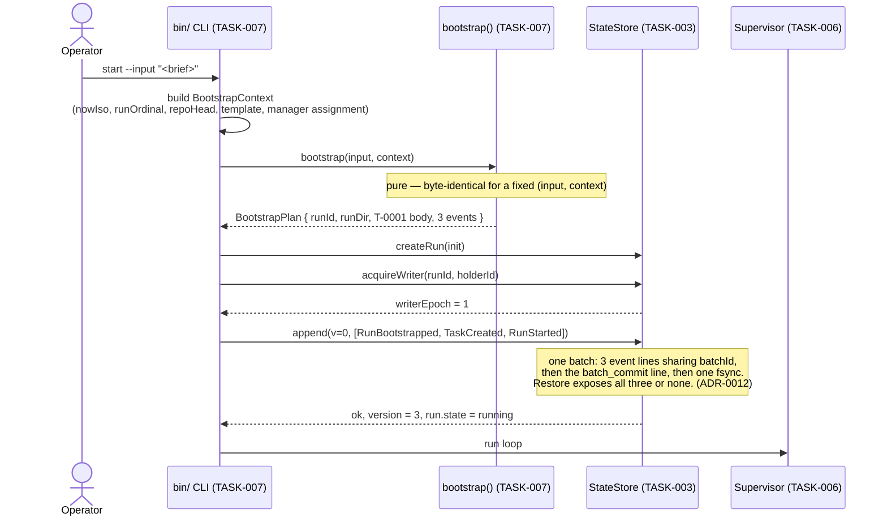
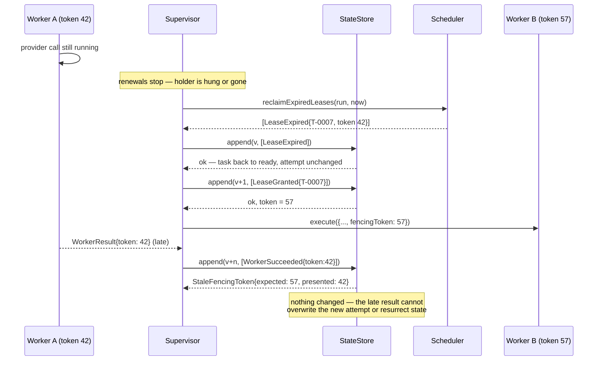

# Runtime Sequence Diagrams

Source diagrams for the eight sequences that carry the runtime's guarantees. Produced under TASK-002, amended under TASK-016, amended again under TASK-024.

Specifications: [LEASES-AND-SCHEDULING.md](../../docs/architecture/runtime/LEASES-AND-SCHEDULING.md), [CRASH-RECOVERY.md](../../docs/architecture/runtime/CRASH-RECOVERY.md), [LIFECYCLE-AND-BOOTSTRAP.md](../../docs/architecture/runtime/LIFECYCLE-AND-BOOTSTRAP.md), [WORKSPACE-LIFECYCLE.md](../../docs/architecture/runtime/WORKSPACE-LIFECYCLE.md), [PROVIDER-ADAPTERS.md](../../docs/architecture/runtime/PROVIDER-ADAPTERS.md), [DURABLE-STATE-AND-CHECKPOINTS.md](../../docs/architecture/runtime/DURABLE-STATE-AND-CHECKPOINTS.md), [STATE-MACHINE.md](../../docs/architecture/runtime/STATE-MACHINE.md).

Amended by TASK-016: every append is shown as a framed batch with a commit record (A-001); the recovery sequence is rebuilt around one decision per task (A-002); three sequences are added for live-run control, process-tree termination, and the workspace lifecycle (A-003 and the workspace module gap).

Amended by TASK-024, resolving findings **A-102** through **A-105**:

- Sequence 2 no longer shows the worker appending durable state. It shows the three-phase handshake in which the **supervisor** appends `ProcessGroupRegistered` before the spawn and hands the worker a receipt. The previous version violated the declared module boundary, which is what A-102 recorded.
- Sequence 2 also shows the durable result record before the result effect is committed (A-104).
- Sequence 4 shows recovery building `WorkerSucceeded` from `run.pendingResults` (A-104).
- Sequence 6 shows the drain's blocked outcome when a tree cannot be verified closed (A-102, ADR-0022).
- Sequence 7 is rebuilt around the split-phase workspace protocol, with the intent durable before any script or Git command (A-103), and shows both repository access paths rather than only the delegated one (A-105).
- Sequence 8 is new: the ingress loop from an owner's publication to quiescence.

## 1. Bootstrap — one input to a running run



## 2. Dispatch: workspace, lease, and fencing

```mermaid
sequenceDiagram
  participant Sup as Supervisor (TASK-006)
  participant Sched as Scheduler (TASK-005)
  participant WS as WorkspaceLifecycle (TASK-017)
  participant Store as StateStore (TASK-003)
  participant Worker as AgentWorker (TASK-004)
  participant Adapter as ProviderAdapter (TASK-004)

  Sup->>Sched: selectDispatchable(run, now)
  Note over Sched: gates: readiness by typed edge, global limit,<br/>per-role limit, write-scope exclusion,<br/>resource lock, workspace readiness<br/>order: (activationClass, createdSeq, taskId)
  Sched-->>Sup: [candidate T-0007]
  Sup->>Sched: grantLease(run, candidate, now)
  Sched-->>Sup: envelope LeaseGranted (token placeholder -1)
  Sup->>Store: append(v, [LeaseGranted])
  Note over Store: substitutes assigned stateVersion<br/>as the fencing token
  Store-->>Sup: ok, token = 42

  Sup->>WS: planPrepare({runId, taskId, attempt, role, llm, baseRef})
  Note over WS: pure — derives and validates branch and worktree;<br/>no script, no git, no filesystem write
  WS-->>Sup: plan{ intentEvent: WorkspacePrepareIntended }
  Sup->>Store: append([WorkspacePrepareIntended])
  Store-->>Sup: ok, receipts[0]
  Sup->>WS: executePrepare(plan, receipt)
  Note over WS: refuses without the receipt (INTENT_NOT_DURABLE).<br/>hooks verified, create-worktree.ps1,<br/>claim-task.ps1 — invoked, never reimplemented
  WS-->>Sup: handle{prepared}, events
  Sup->>Store: append([WorkspacePrepared{lockSessionId}])

  Sup->>Store: append([DispatchStarted{token:42, attempt:1, idempotencyKey}])
  Note over Store: illegal unless the workspace is prepared;<br/>sets attemptStartedAt

  Sup->>Worker: planInvocation(assignment)
  Note over Worker: pure — invocationId, group name, command vector.<br/>Spawns nothing, appends nothing
  Worker-->>Sup: plan{ invocationId, groupKind, groupName }
  Sup->>Store: append([ProcessGroupRegistered]) — durable BEFORE the spawn
  Store-->>Sup: ok, receipts[0]
  Sup->>Worker: beginInvocation(plan, receipt, signal)
  Note over Worker: refuses without the receipt (RegistrationNotDurable)
  Worker->>Adapter: spawn into the owned group
  Worker-->>Sup: binding{pid, groupRef, processStartTime}
  Sup->>Store: append([ProcessGroupBound]) — immediately after
  Sup->>Worker: completeInvocation(handle, signal)

  loop every leaseRenewIntervalMs
    Sup->>Store: append(LeaseRenewed{token:42})
    Note over Store: expiresAt extended, token unchanged
  end

  Adapter-->>Worker: AdapterOutcome
  Note over Worker: verified tree close; the worker appends nothing
  Worker-->>Sup: WorkerResult{token: 42, close}
  Sup->>Store: append([ProcessGroupClosed{verifiedExit:true}])

  Sup->>Store: append([WorkerResultRecorded{ adoptable: summary + proposedTasks }])
  Note over Store: durable BEFORE the result effect is committed,<br/>so recovery can rebuild WorkerSucceeded (A-104)

  Sup->>WS: planFinalize(handle, {commitMessage, writeScope, remote,<br/>integrationBranch, publicationClass})
  WS-->>Sup: plan{ intentEvent: WorkspaceFinalizeIntended }
  Sup->>Store: append([WorkspaceFinalizeIntended])
  Store-->>Sup: ok, receipts[0]
  Sup->>WS: executeFinalize(plan, receipt)
  Note over WS: validate-write-scope.ps1 (delegated), then direct git<br/>commit and push of one derived ref, then look-up-then-<br/>create-or-update the PR, then release-task.ps1 (delegated)
  WS-->>Sup: publication, events
  Sup->>Store: append(v, [ArtifactPublished, EffectCommitted,<br/>WorkspaceFinalized, WorkerSucceeded{token:42}])
  Store-->>Sup: ok — pendingResults[taskId] cleared
```

Two boundary properties are visible in this diagram and were not visible in the superseded one:

- **Every append is the supervisor's.** The worker and the workspace module produce plans, bindings, and event envelopes; neither has a lifeline reaching `Store`. That is the module boundary as declared, and A-102 recorded that the previous diagram broke it.
- **Every side effect is preceded by a durable intent.** `ProcessGroupRegistered` before the spawn, `WorkspacePrepareIntended` before the first script, `WorkspaceFinalizeIntended` before validation and commit. The receipt is what makes the ordering enforceable rather than conventional.

## 3. Lease expiry and the rejected late write

The sequence fencing exists for. No coordination with the abandoned worker is needed.



## 4. Crash recovery — one decision per task

Amended by TASK-016. The superseded version showed phase 4 emitting `LeaseExpired` and phases 5 and 6 then emitting `WorkerSucceeded`, `TaskBlocked`, or `TaskTimedOut` for the same task in the same batch. That is finding A-002: those events are legal only from `running`, and phase 4 had already moved the task to `ready`.

```mermaid
sequenceDiagram
  participant P2 as New process (epoch 2)
  participant Rec as RecoveryCoordinator (TASK-008)
  participant Store as StateStore (TASK-003)
  participant WS as WorkspaceLifecycle (TASK-017)
  participant Tree as ProcessTreeController (TASK-004)

  Note over P2: previous process died in `running` at epoch 1

  P2->>Rec: recover(runId, {holderId, now})
  Rec->>Store: acquireWriter(runId, holderId)
  alt heartbeat is fresh
    Store-->>Rec: WriterAlive — abort the attach
  else stale or absent
    Store-->>Rec: epoch = 2
  end

  Rec->>Store: restore(runId)
  Store->>Store: newest checksum-valid checkpoint<br/>+ committed batches only;<br/>uncommitted suffix discarded whole
  Store-->>Rec: run, version, fromCheckpoint, replayedEvents,<br/>discardedUncommittedEvents, lastCommittedBatchId
  Rec->>Store: truncateToLastCommittedBatch(runId)

  Rec->>Store: append([RunResumeRequested{epoch:2}])
  Note over Store: run -> recovering

  Rec->>Tree: Phase 5 — reclaimOrphan for every registered, unclosed invocation
  Note over Tree: fence always; terminate when bound and identity verifies;<br/>pid_reuse or unbound -> orphan_unresolved
  Tree-->>Rec: TreeCloseOutcome[]
  Rec->>WS: Phase 6 — reconcile(runId, context)
  Note over WS: never force-releases a lock, never republishes,<br/>never opens a second pull request
  WS-->>Rec: WorkspaceReconcileEntry[]

  Rec->>Rec: Phase 4 — one decision per task from the restored record<br/>inputs: pre-batch state, lease state, ledger state, deadline,<br/>activation block, pendingResults entry<br/>(Phase 6 findings are an input, not a second pass)
  Note over Rec: adopt (built from pendingResults[taskId]) |<br/>escalate (indeterminate_effect | unreconstructable_result) |<br/>reclaim | reclaim_activation |<br/>retry_timeout | exhaust_timeout | none

  Rec->>Store: append(v, [one event sequence per task,<br/>ProcessGroupClosed*, WorkspaceReconciled*,<br/>RunRecoveryCompleted last])
  Note over Store: one batch with a commit record.<br/>Every event is legal from the restored state,<br/>by construction. No two address the same task.
  Store-->>Rec: ok — run -> running
  Rec->>Store: checkpoint(runId, version)
```

## 5. Live-run control — a second `pause` reaching a running supervisor

```mermaid
sequenceDiagram
  actor Operator
  participant CLI2 as bin/ CLI, second invocation
  participant Inbox as runDir/control/
  participant Sup as Supervisor (TASK-006)
  participant Ctl as ControlChannel (TASK-007)
  participant Store as StateStore (TASK-003)

  Operator->>CLI2: pause --run <runId>
  CLI2->>CLI2: read writer.lock -> targetWriterEpoch
  CLI2->>Ctl: submit({requestId, runId, kind:'pause', requestedBy, targetWriterEpoch})
  Ctl->>Inbox: write req-<id>.json.tmp, fsync, rename, fsync dir

  loop each run-loop iteration
    Sup->>Ctl: drainPending(run, now)
    Ctl->>Inbox: read all req-*.json
    Note over Ctl: validate kind, size, id pattern, epoch, TTL;<br/>sort by (requestedAt, requestId);<br/>stop outranks pause in one pass
    Ctl-->>Sup: accepted[], rejected[] (rejections already acked and swept)
  end

  Sup->>Store: append([ControlRequestAccepted{requestId}, RunPauseRequested])
  Note over Store: durable ordering is journal order;<br/>a duplicate requestId is rejected
  Store-->>Sup: ok — run -> pausing
  Sup->>Ctl: acknowledge({requestId, status:'accepted', runState, stateVersion})
  Ctl->>Inbox: write ack-<id>.json, move request to consumed/

  CLI2->>Ctl: awaitAck(requestId, controlAckTimeoutMs)
  Ctl-->>CLI2: accepted
  CLI2-->>Operator: Turkish message; exit 0
```

## 6. Drain deadline: process-tree termination with verified exit

The sequence finding A-003 exists for. A child that spawns a grandchild and ignores the first cancellation must not survive the command.

```mermaid
sequenceDiagram
  participant Life as lifecycle (TASK-007)
  participant Tree as ProcessTreeController (TASK-004)
  participant Child as provider process
  participant GChild as grandchild
  participant Store as StateStore (TASK-003)

  Note over Life: drainTimeoutMs elapsed; tasks abandoned at the task level

  Life->>Tree: cancelTree(invocationId, deadlines)
  Tree->>Child: AbortSignal, then graceful termination to the whole group
  Note over Child: traps it and keeps running — the expected case
  GChild-->>GChild: still alive

  Note over Tree: gracefulCancelGraceMs elapses
  Tree->>Child: forced: SIGKILL to -pgid / TerminateJobObject
  Tree->>GChild: same signal, same group

  loop re-escalate and verify until treeCloseTotalBudgetMs
    Tree->>Tree: verify — kill(-pgid,0) == ESRCH /<br/>job reports zero assigned pids
  end

  alt exit verified
    Tree-->>Life: TreeCloseOutcome{escalation:'forced', verifiedExit:true}
    Life->>Store: append([ProcessGroupClosed{verifiedExit:true}])
    Note over Store: must be durable BEFORE releaseWriter
    Life->>Store: checkpoint, then append([RunDrainCompleted{intent:'pause',<br/>treeClosure:'all_verified'}])
    Life->>Store: releaseWriter(runId, epoch)
    Note over Life: run -> paused; exit 0
  else budget exhausted, exit not verified
    Tree-->>Life: TreeCloseOutcome{verifiedExit:false,<br/>unresolvedReason:'verify_timeout'}
    Life->>Store: append([ProcessGroupClosed{verifiedExit:false}])
    Life->>Store: checkpoint, then append([RunDrainBlocked{intent:'pause',<br/>reason:'unverified_process_tree', unresolvedInvocationIds}])
    Life->>Store: releaseWriter(runId, epoch)
    Note over Life: run stays `pausing` — NOT paused.<br/>Turkish message names the run; exit 5.<br/>The next attach fences and terminates (ADR-0022)
  end
```

The `else` branch is the whole of the [ADR-0022](../../docs/adr/0022-unqualified-drain-closure.md) change. There is no path in this diagram from an unverified tree to a `paused` run, which is what makes the pause post-condition unqualified.

## 7. Workspace finalize: durable intent, publication, and idempotent pull-request identity

Amended by TASK-024. The superseded version showed the supervisor appending `WorkspaceFinalizeIntended` and then calling a single `finalize`, which the interface could not support: the module returned its intent event only after the operation, so no caller could make the intent durable first. That is finding A-103. The split-phase protocol below makes the ordering a property of the call sequence.

```mermaid
sequenceDiagram
  participant Sup as Supervisor (TASK-006)
  participant WS as WorkspaceLifecycle (TASK-017)
  participant Scripts as scripts/orchestration/*.ps1
  participant Git as repository and remote
  participant Store as StateStore (TASK-003)

  Sup->>WS: planFinalize(handle, request{publicationClass, ...})
  Note over WS: pure — no script, no git, no filesystem write
  WS-->>Sup: plan{ intentEvent: WorkspaceFinalizeIntended }
  Sup->>Store: append([WorkspaceFinalizeIntended])
  Store-->>Sup: ok, receipt
  Sup->>WS: executeFinalize(plan, receipt)
  Note over WS: without a matching receipt: failed{INTENT_NOT_DURABLE},<br/>no process spawned, no git command run

  WS->>Scripts: validate-write-scope.ps1 -IncludeWorkingTree   (delegated)
  alt non-zero exit
    Scripts-->>WS: failure
    WS-->>Sup: failed — no commit, no push, no PR
  else valid
    WS->>Git: git add -- <declared write scope>; git commit      (direct)
    WS->>Git: git push origin refs/heads/agent/<llm>/<role>/<task-id>
    Note over WS,Git: the only push the module can construct;<br/>no ref parameter, no --no-verify, no ALLOW_MAIN_PUSH
    alt remote unreachable or credentials absent
      Git-->>WS: failure
      alt publicationClass == 'runtime'
        WS-->>Sup: blocked{typed class, reason} — never "succeeded" on a local commit
      else publicationClass == 'bootstrap'
        WS-->>Sup: publication{publication:'local-only', reason} — for this task only
      end
    else pushed
      WS->>Git: look up an open PR with head = task branch        (direct)
      alt one exists
        WS->>Git: update it
      else none
        WS->>Git: create one, base = integration branch
      end
      WS-->>Sup: publication{commit, branch, pullRequest}, events
      Sup->>Store: append([ArtifactPublished])
      Note over Store: identity is durable BEFORE the lock is released
      WS->>Scripts: release-task.ps1 (delegated; never -Force, only our session)
      Sup->>Store: append([WorkspaceFinalized])
    end
  end
```

Two things this diagram states that the previous one did not, both required by A-103 and A-105:

- The intent is durable before the first script runs, and the module refuses to act without proof of it.
- The module reaches the repository two ways, and the diagram labels which is which. Scope validation and lock release are **delegated** to the human-controlled scripts; commit, push, and pull-request operations are **direct**. Claiming the module only ever delegates would contradict the contract and the code a reviewer will read.

The same split-phase shape governs `prepare` (sequence 2) and `abandon`, whose intent event `WorkspaceAbandonIntended` enters the `abandoning` state that TASK-016 declared and no event reached.

## 8. Ingress: from an owner's publication to quiescence

New under TASK-024. The loop finding F-301 required and finding A-101 recorded as unrepresentable. No participant writes a task record, and the consuming activation's own effects commit is never an ingress fact.

```mermaid
sequenceDiagram
  participant Owner as A gate or implementation owner
  participant Repo as repository and remote
  participant Adp as ingress adapters (TASK-026)
  participant Inbox as IngressInbox (TASK-026)
  participant Obs as ingress observer (TASK-005)
  participant Store as StateStore (TASK-003)
  participant Act as the activation task

  Owner->>Repo: publish its own artifact inside its own write scope
  Note over Owner,Repo: no write under tasks/ — that is the F-201 rule

  Adp->>Repo: read published facts (read-only)
  Adp->>Adp: reject any commit authored by the consuming<br/>activation on its own branch — self-exclusion
  Adp->>Inbox: append([candidate{matchedClasses, producerTask,<br/>sourceCommit, sourcePath, contentHash}])
  Note over Inbox: resolve class by INGRESS_CLASS_PRECEDENCE;<br/>compute factId; skip if already present;<br/>order by ascending sourceCommit, never by a clock;<br/>assign seq once, from the active epoch's seqBase
  Inbox-->>Adp: appended[], deduplicated[], highWaterMark

  Obs->>Inbox: highWaterMark()
  Inbox-->>Obs: ingressSeq
  Obs->>Store: append([IngressHighWaterMarkObserved{epoch, ingressSeq}])
  Note over Store: rejected if it would lower run.ingressSeq

  Obs->>Obs: dispatchable when run.ingressSeq > activation.lastConsumedEventSeq
  Obs->>Store: append([TaskActivated{observedIngressSeq}])
  Note over Store: records an observation; reserves nothing

  Act->>Inbox: read(afterSeq = cursor, throughSeq = ingressSeq)
  Inbox-->>Act: entries
  Act->>Act: perform its effects — idempotent by contract

  Act->>Store: append ONE batch: [...effects,<br/>IngressRangeConsumed{fromSeq, throughSeq, rows},<br/>WorkerSucceeded]
  Note over Store: ledger rows created already consumed;<br/>cursor advances to throughSeq.<br/>If this batch does not commit, the cursor is unchanged,<br/>no row exists, and the same range is consumed again

  alt cursor == run.ingressSeq
    Store-->>Act: task -> quiescent
    Note over Store,Act: demonstrable, because the activation's own<br/>effects commit is excluded from ingress
  else cursor < run.ingressSeq
    Store-->>Act: task -> ready, consume the next range
  end
```

Six properties are visible here, and each is one of F-301's named failure modes made unreachable:

| Failure mode F-301 named | Where this sequence refuses it |
|---|---|
| A backdated publication inserts a fact before the cursor | `seq` is assigned at append, so a late fact takes the **next** position |
| One commit matches several classes | `INGRESS_CLASS_PRECEDENCE` is applied by the inbox, once, over `matchedClasses` |
| Deleting the producing ref lowers the mark | The mark is `max(seq)` over durable entries; the adapters read refs, the inbox does not |
| An unseen historical fact is discovered late | It receives the next free `seq` and is consumed exactly once |
| The activation's own effects commit raises the mark | Self-exclusion, enforced by the adapter and again by `append` |
| A crash between dispatch and cursor advance | One batch: cursor and ledger move together or not at all |

The supervisor's append path is the writer in the final step, as it is everywhere else; the activation task proposes the batch and does not write it. The `Act ->> Store` arrow is drawn for legibility of the loop, not as a second writer.
