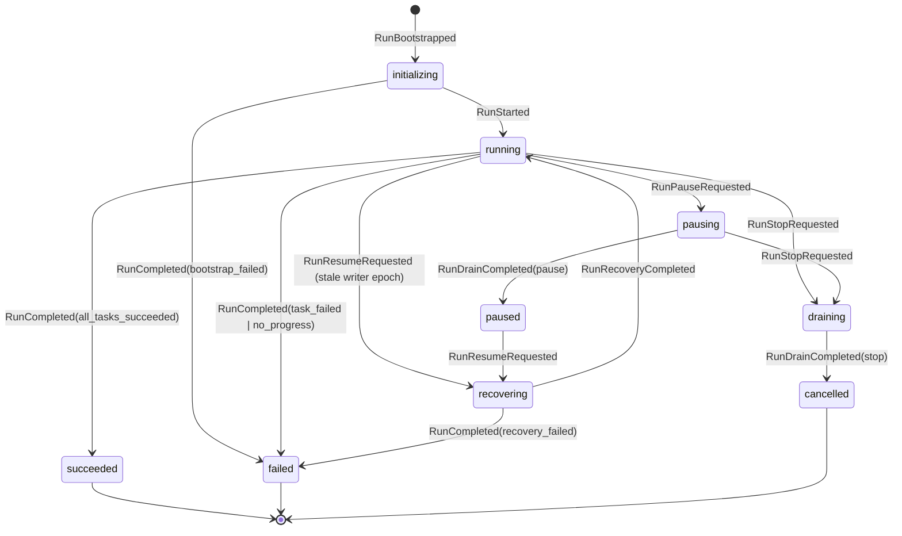
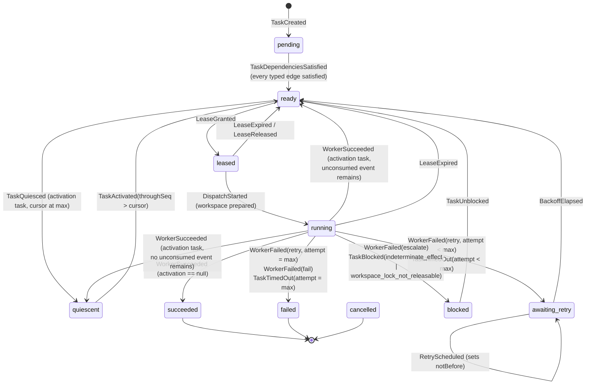

# Runtime State Diagrams

Source diagrams for the run and task state machines. Produced under TASK-002, amended under TASK-016.

- Specification: [STATE-MACHINE.md](../../docs/architecture/runtime/STATE-MACHINE.md)
- Decisions: [ADR-0003](../../docs/adr/0003-deterministic-run-and-task-state-machine.md), extended by [ADR-0013](../../docs/adr/0013-single-decision-recovery-reconciliation.md) and [ADR-0015](../../docs/adr/0015-typed-scheduling-gate-and-activation-contracts.md)

Amended by TASK-016: the task diagram gains the `quiescent` state and its two edges, and the `pending -> ready` edge is relabelled, because dependency satisfaction is now per typed edge rather than "every dependency is `succeeded`".

The transition tables in the specification are normative. These diagrams are a reading aid and omit the `RunCancelled` edge from every non-terminal task state for legibility. They also omit the events that record a durable fact without changing a state — gate verdicts, publication, integration, control acceptance, process-group and workspace records — which are listed in the specification.

## Run states

`running --> recovering` is what makes a crash detectable without a crash marker: a persisted run in `running` whose writer epoch is stale is by definition a run whose process died.

## Task states

Details the diagram encodes deliberately:

- `attempt` increments at `DispatchStarted`, so the `leased --> ready` edge costs no retry budget. Scheduler churn cannot exhaust a task.
- `blocked` is not terminal. It is the resting place for work that a human or another role can still unblock, and it is why the CLI has a distinct exit code 3.
- `quiescent` is not terminal and is **not** `blocked`. It is the resting place for event-triggered recurring work whose cursor has caught up. It waits on an event the runtime will append, not on a decision a human must make, so it does not drive exit code 3 and it counts as settled for the completion predicate.
- There is no `quiescent --> leased` edge. A quiescent task must pass through `TaskActivated`, which records the range it will consume. Dispatching without one is the control-plane loop the state exists to prevent.
- The cursor advances only on `WorkerSucceeded`, never on `TaskActivated`, which is what makes an activation exactly-once across a crash.

## Recovery reconciliation

Recovery emits exactly one decision per task, and each decision expands to one event sequence already present in the diagram above. It introduces no new state and no new edge — that is the point of [ADR-0013](../../docs/adr/0013-single-decision-recovery-reconciliation.md). The superseded design emitted `LeaseExpired` and then a second event for the same task, which traverses `running --> ready` and then attempts an edge that exists only from `running`.

| Decision | Edge traversed |
|---|---|
| `adopt` | `running --> succeeded` by `WorkerSucceeded` |
| `escalate` | `running --> blocked` by `TaskBlocked` |
| `reclaim` | `running --> ready` or `leased --> ready` by `LeaseExpired` |
| `retry_timeout` | `running --> awaiting_retry` by `TaskTimedOut`, then `RetryScheduled` |
| `exhaust_timeout` | `running --> failed` by `TaskTimedOut` |

## Terminal states

| Level | Terminal states | Non-terminal resting states |
|---|---|---|
| Run | `succeeded`, `failed`, `cancelled` | `paused` |
| Task | `succeeded`, `failed`, `cancelled` | `blocked`, `quiescent`, `awaiting_retry` |

Every event addressed to a terminal run or a terminal task is rejected as `IllegalTransition`. The full illegal-transition list is in the specification.
