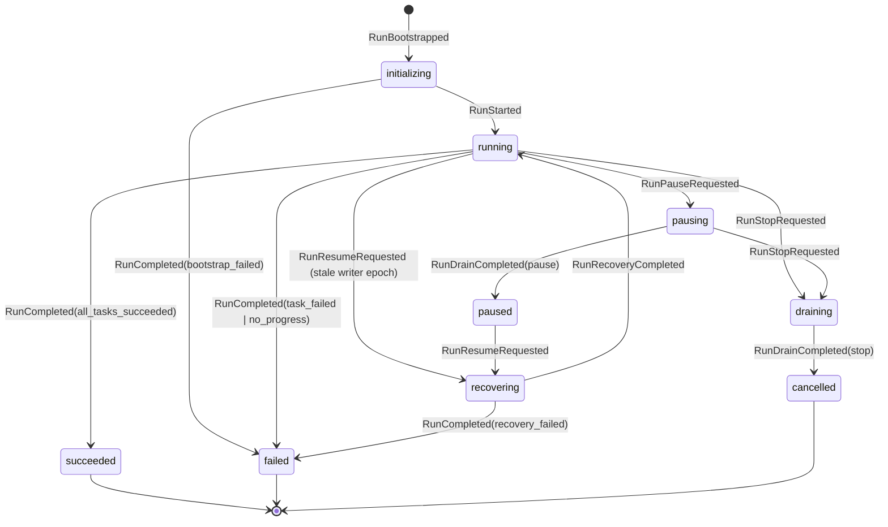
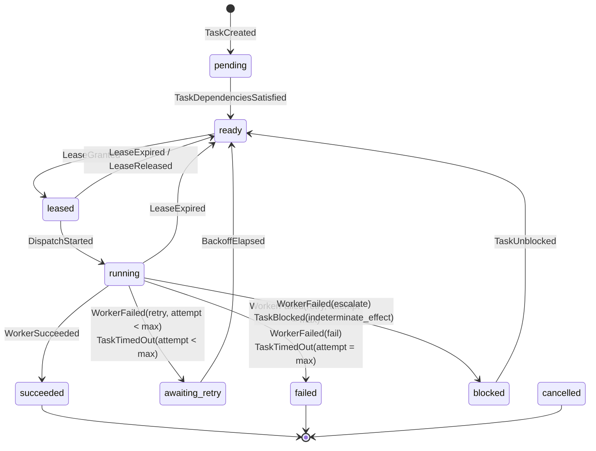

# Runtime State Diagrams

Source diagrams for the run and task state machines. Produced under TASK-002.

- Specification: [STATE-MACHINE.md](../../docs/architecture/runtime/STATE-MACHINE.md)
- Decision: [ADR-0003](../../docs/adr/0003-deterministic-run-and-task-state-machine.md)

The transition tables in the specification are normative. These diagrams are a reading aid and omit the `RunCancelled` edge from every non-terminal task state for legibility.

## Run states

`running --> recovering` is what makes a crash detectable without a crash marker: a persisted run in `running` whose writer epoch is stale is by definition a run whose process died.

## Task states

Two details the diagram encodes deliberately:

- `attempt` increments at `DispatchStarted`, so the `leased --> ready` edge costs no retry budget. Scheduler churn cannot exhaust a task.
- `blocked` is not terminal. It is the resting place for work that a human or another role can still unblock, and it is why the CLI has a distinct exit code 3.

## Terminal states

| Level | Terminal states |
|---|---|
| Run | `succeeded`, `failed`, `cancelled` |
| Task | `succeeded`, `failed`, `cancelled` |

Every event addressed to a terminal run or a terminal task is rejected as `IllegalTransition`. The full illegal-transition list is in the specification.
