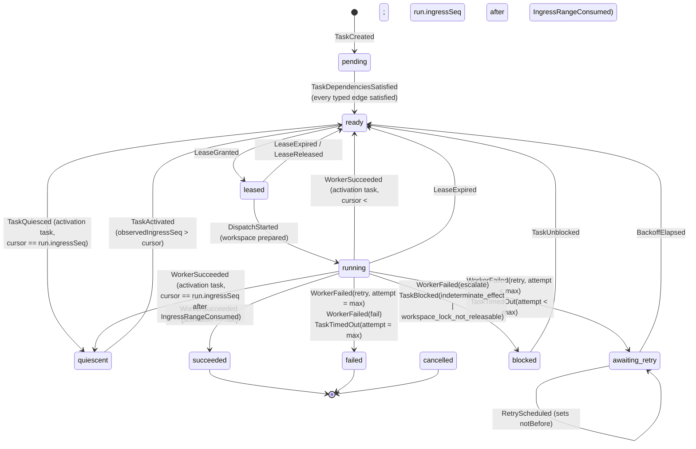

# Runtime State Diagrams

Source diagrams for the run and task state machines. Produced under TASK-002 and amended under TASK-016, TASK-024, and TASK-028.

- Specification: [STATE-MACHINE.md](../../docs/architecture/runtime/STATE-MACHINE.md)
- Decisions: [ADR-0003](../../docs/adr/0003-deterministic-run-and-task-state-machine.md), extended by [ADR-0013](../../docs/adr/0013-single-decision-recovery-reconciliation.md) and [ADR-0015](../../docs/adr/0015-typed-scheduling-gate-and-activation-contracts.md), and amended by [ADR-0017](../../docs/adr/0017-durable-ingress-inbox-and-ingress-epochs.md), [ADR-0020](../../docs/adr/0020-durable-adoptable-results-for-recovery.md), and [ADR-0022](../../docs/adr/0022-unqualified-drain-closure.md)

Amended by TASK-016: the task diagram gains the `quiescent` state and its two edges, and the `pending -> ready` edge is relabelled, because dependency satisfaction is now per typed edge rather than "every dependency is `succeeded`".

Amended by TASK-024 for the terminal-task evidence exceptions and by TASK-028 for the blocked-drain attach path, recovery of unverified process closures, result-effect ordering, and the canonical `ReconciliationInput`.

The transition tables in the specification are normative. These diagrams are a reading aid and omit the `RunCancelled` edge from every non-terminal task state for legibility. They also omit the events that record a durable fact without changing a state — gate verdicts, publication, integration, control acceptance, adoptable results, process-group and workspace records — which are listed in the specification.

## Run states

```mermaid
stateDiagram-v2
  [*] --> initializing : RunBootstrapped
  initializing --> running : RunStarted
  initializing --> failed : RunCompleted(bootstrap_failed)

  running --> pausing : RunPauseRequested
  running --> draining : RunStopRequested
  running --> recovering : RunResumeRequested (stale writer epoch)
  running --> succeeded : RunCompleted(all_tasks_succeeded)
  running --> failed : RunCompleted(task_failed | no_progress)

  pausing --> paused : RunDrainCompleted(pause)<br/>(every tree verifiedExit true)
  pausing --> pausing : RunDrainBlocked(pause)<br/>(tree close budget exhausted; exit 5)
  pausing --> recovering : RunResumeRequested<br/>(stale writer epoch)
  pausing --> draining : RunStopRequested

  paused --> recovering : RunResumeRequested

  draining --> cancelled : RunDrainCompleted(stop)<br/>(every tree verifiedExit true)
  draining --> draining : RunDrainBlocked(stop)<br/>(tree close budget exhausted; exit 5)
  draining --> recovering : RunResumeRequested<br/>(stale writer epoch)

  recovering --> running : RunRecoveryCompleted
  recovering --> failed : RunCompleted(recovery_failed)

  succeeded --> [*]
  failed --> [*]
  cancelled --> [*]
```

`running --> recovering` is what makes a crash detectable without a crash marker: a persisted run in `running` whose writer epoch is stale is by definition a run whose process died.

The `RunDrainBlocked` self-edges retain the requested intent without claiming closure. ADR-0026 adds the two legal attach edges: a new writer may enter `recovering` from either blocked-drain state, Phase 5 selects every invocation whose latest closure is absent **or has `verifiedExit:false`**, and `RunRecoveryCompleted` reissues the retained pause or stop intent before admission. There is no edge into `paused` or `cancelled` that a surviving descendant can traverse.

## Task states

Details the diagram encodes deliberately:

- `attempt` increments at `DispatchStarted`, so the `leased --> ready` edge costs no retry budget. Scheduler churn cannot exhaust a task.
- `blocked` is not terminal. It is the resting place for work that a human or another role can still unblock, and it is why the CLI has a distinct exit code 3.
- `quiescent` is not terminal and is **not** `blocked`. It is the resting place for event-triggered recurring work whose cursor has caught up with the durable ingress inbox. It waits on a fact another owner will publish, not on a decision a human must make, so it does not drive exit code 3 and it counts as settled for the completion predicate.
- There is no `quiescent --> leased` edge. A quiescent task must pass through `TaskActivated`, which records the observation that raised the dispatch. Dispatching without one is the control-plane loop the state exists to prevent.
- The cursor advances only on `IngressRangeConsumed`, which is applied in the same batch as the activation's effects and its `WorkerSucceeded`. `TaskActivated` reserves nothing. That is what makes an activation exactly-once across a crash, and it is why consumption state lives in exactly one field.

## Recovery reconciliation

Recovery constructs exactly one canonical `ReconciliationInput` per task and emits exactly one decision whose event sequence is already present above. ADR-0030 supersedes ADR-0013's former input-count wording; the type and its sole cardinality statement are normative there. Result adoption is legal only when the matching attempt already has `WorkerResultRecorded`, exactly one `EffectIntentRecorded{isTaskResultEffect:true}`, and `EffectCommitted`; recovery then appends only `WorkerSucceeded`.

| Decision | Edge traversed |
|---|---|
| `adopt` | `running --> succeeded` by `WorkerSucceeded`, built from the durable `AdoptableResult` in `run.pendingResults` |
| `escalate` | `running --> blocked` by `TaskBlocked`, with reason `indeterminate_effect` or — when a committed result has no adoptable record — `unreconstructable_result` |
| `reclaim` | `running --> ready` or `leased --> ready` by `LeaseExpired` |
| `reclaim_activation` | `running --> ready` by `LeaseExpired`, for a task carrying an `activation` block; an activation is never adopted |
| `retry_timeout` | `running --> awaiting_retry` by `TaskTimedOut`, then `RetryScheduled` |
| `exhaust_timeout` | `running --> failed` by `TaskTimedOut` |

## Terminal states

| Level | Terminal states | Non-terminal resting states |
|---|---|---|
| Run | `succeeded`, `failed`, `cancelled` | `paused` |
| Task | `succeeded`, `failed`, `cancelled` | `blocked`, `quiescent`, `awaiting_retry` |

Every event addressed to a **terminal run** is rejected as `IllegalTransition`, without exception.

For a **terminal task** the rule is narrower, and this is the correction finding A-105 required. Every event that would **change** a terminal task's state is rejected. Exactly four evidence-recording events remain legal against a terminal task, and none of them changes its state:

| Event | Why it must be legal after the task is terminal |
|---|---|
| `ArtifactPublished` | A publication may be superseded forward after the task succeeded |
| `GateVerdictRecorded` | An assembly gate runs **after** its target succeeded and merged, by definition. A target that had to be non-terminal for its verdict to be recordable could never have one |
| `BranchIntegrated` | Integration follows success |
| `RemediationCompleted` | Remediation traceability is recorded against a task that has already finished |

The exception is safe for three reasons: none of the four changes `TaskState`; none can rewrite a value, because `gateVerdicts` is append-only, `integration` may be set once, and `publication` may only be superseded forward; and none applies to a terminal run.

This list is the same list as [STATE-MACHINE.md](../../docs/architecture/runtime/STATE-MACHINE.md#evidence-events-and-the-terminal-task-rule). The full illegal-transition list is in the specification.
